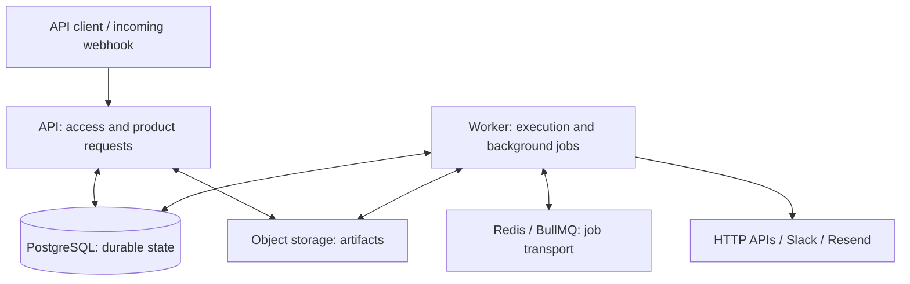
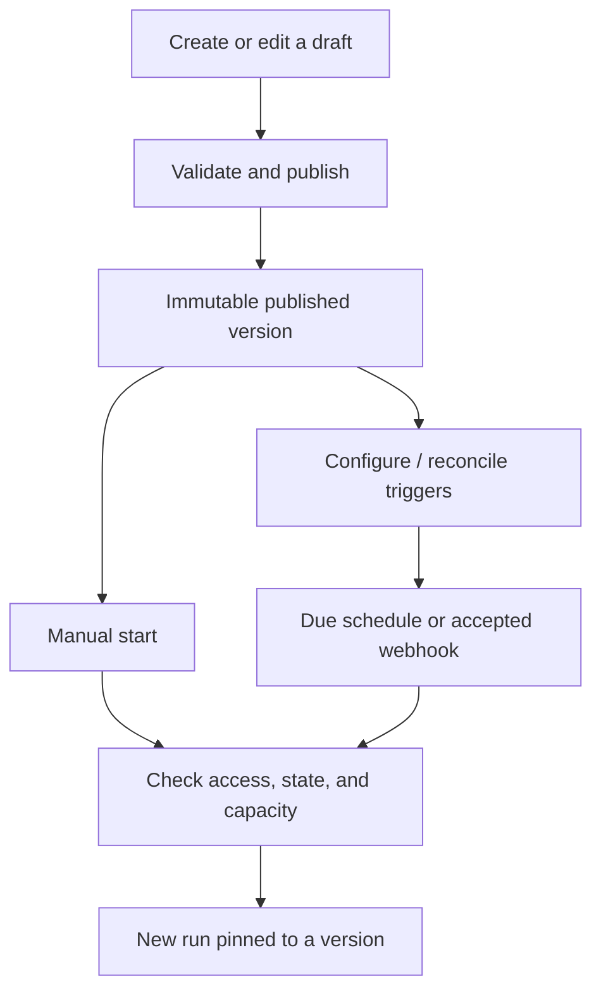

# Codebase map

Start here to understand what Pertexo does, what each part contains, and how a
workflow runs. Read the overview first; follow source links only when you need
implementation details. This is a map of the **current backend**, not a list of
future features. A [React web foundation](../apps/web/README.md) now exists, but
has no editor, product screens or API integration yet.

Quick navigation:

- [The system in one minute](#the-system-in-one-minute)
- [Features you can use through the backend](#features-you-can-use-through-the-backend)
- [How a workflow moves through the system](#how-a-workflow-moves-through-the-system)
- [Applications and what they contain](#applications-process-ownership)
- [Shared packages](#packages-shared-responsibility)
- [Infrastructure and checks](#build-and-verification)
- [Feature-to-code and test links](#behavior-to-owner-routes)

The [backend plan](./workflow-platform-backend-plan.md) and accepted ADRs remain
authoritative for contracts. The [current status](./current-implementation-status.md)
tracks delivery and the production-environment checks still outstanding.

## The system in one minute

Pertexo lets a client define a workflow, publish a fixed version, start runs,
and inspect what happened. A **workflow** is the reusable definition; a
**version** is a published snapshot; a **run** is one execution; a **node** is
one step within it.

- **API:** receives requests, checks permissions, and returns data or live updates.
- **Worker:** executes steps and handles background scheduling and recovery.
- **PostgreSQL:** remembers workflows, run progress, permissions, and durable work.
- **Redis/BullMQ:** delivers queued jobs; it is not the permanent run history.
- **Object storage:** holds artifacts and protected control records.
- **Provider adapters:** make supported outbound HTTP, Slack, and email calls.

The arrows below mean “communicates with,” not execution order. Maintenance
and operator processes are described in the application table below.

The API also uses Redis for rate limiting and live-event notifications; those
supporting connections are omitted to keep the diagram readable. A package is
a shared library used by these processes, not another independently running
service. Infrastructure scripts build, check, or operate the system.

## Features you can use through the backend

These are backend capabilities, not claims that a UI or live provider account
is configured. Permissions and the API's configured supported release determine what
an individual request can use.

| Feature area | What it lets a client do | Main code owner |
| --- | --- | --- |
| Login and workspace access | Sign in/out through an identity provider-backed session, read your profile, create workspaces, and list members. Access is checked against membership and role. | [identity-workspace](../apps/api/src/identity-workspace/), [identity](../apps/api/src/identity/), [workspaces](../apps/api/src/workspaces/) |
| Workspace lifecycle | Request workspace deletion, restore a pending deletion where allowed, and poll the lifecycle operation. Dedicated background processes apply the operation. | [identity-workspace](../apps/api/src/identity-workspace/), [lifecycle command](../apps/lifecycle-command/src/) |
| Connections | Create, rotate, revoke, and test saved HTTP, Slack, or email credentials, and look up Slack channel names with a saved bot token. | [connections](../apps/api/src/connections/) |
| Node discovery | Read the catalog for the API's configured release, including node input/configuration schemas and availability flags. | [catalog](../apps/api/src/catalog/), [node-catalog](../packages/node-catalog/src/) |
| Workflow authoring | Create, read, rename, edit, and validate drafts; publish immutable versions; inspect versions and restore one into the draft. The name has its own revision (ADR 041). | [workflow-authoring](../apps/api/src/workflow-authoring/) |
| Workflow lifecycle | Archive and restore workflows; inspect activation separately from whether the workflow is archived. | [workflow-authoring](../apps/api/src/workflow-authoring/) |
| Runs and history | Start a manual run, list retained history, read exact bounded run statistics ([ADR 044](./adr/044-bounded-workspace-run-statistics.md)), inspect a known run and its node status, request cancellation, replay a prior run, and follow live events. | [workflow-runs](../apps/api/src/workflow-runs/), [executions](../apps/api/src/executions/) |
| Node preview | Validate a draft node without execution, or request a bounded test execution and poll its result. | [node-testing](../apps/api/src/node-testing/), [worker execution](../apps/worker/src/execution/) |
| Scheduled workflows | Define a Schedule node in a draft; after publication, inspect trigger health and enable/disable it. Workers handle timezone-aware due starts and trigger reconciliation. | [schedules](../apps/api/src/schedules/), [worker triggers](../apps/worker/src/triggers/) |
| Webhook workflows | Provision endpoints, rotate keys/signing secrets, inspect trigger health and the metadata-only delivery log, and accept signature-authenticated incoming requests with replay and admission checks. | [webhooks](../apps/api/src/webhooks/) |
| Artifacts | Request uploads, finalize verified objects, and obtain authorized download access under workspace capacity limits. | [artifacts](../apps/api/src/artifacts/), [artifact-store](../packages/artifact-store/src/) |
| Run failure notifications | Manage versioned destinations; read, set, and clear each workflow's notification policy through the API; record and deliver notification work separately from the run result. | [destination controller](../apps/api/src/connections/failure-notification-destinations.controller.ts), [worker handler](../apps/worker/src/execution/failure-notification-handler.ts) |

Current API limits: there is no free-text run search endpoint, general connection
list/get endpoint, workspace list/get endpoint, or member invitation/role-edit
endpoint. Stored domain capabilities do not automatically imply public routes.
Feature endpoints also require their configured runtime dependencies.

### Workflow building blocks

Definitions and executors exist in [nodes-core](../packages/nodes-core/src/)
and [integrations](../packages/integrations/src/). The
[catalog](../packages/node-catalog/src/registry.ts) determines which versions
are available in a supported release; this table is not a replacement for that
runtime catalog.

| Purpose | Nodes / capability | In plain language |
| --- | --- | --- |
| Start | Manual, Schedule, Webhook | Begin from a user request, a due time, or an incoming webhook. |
| Transform and check data | Set/Map, Validate | Shape values and check them against configured validation rules. |
| Choose a path | Condition, Switch | Select a true/false branch or an ordered matching case. |
| Repeat and combine | For Each, Parallel, Merge | Process a bounded collection, run parallel branches, and combine their results. |
| Pause or finish | Wait, Terminate | Persist a pause until it is due, or finish the workflow. |
| Contact another service | HTTP Request, Slack Send Message, Email Send Notification | Call an API, send a Slack message, or send email through Resend. |

Input mappings and restricted JSONata expressions are supported by
[workflow-model](../packages/workflow-model/src/); they are not an unrestricted
custom-code runtime.

## How a workflow moves through the system

### From editing to a run

Publishing is not the same as executing. Editing a draft later does not change
a version already pinned by a run. A schedule or webhook also needs usable
trigger configuration; “published” alone does not mean its trigger is ready.

### What happens after a run is accepted

1. **Save first.** Run acceptance stores the run and dispatch intent together
   in PostgreSQL. That saved intent is called an **outbox** record.
2. **Deliver the job.** The worker's dispatcher reads the outbox and sends an
   identifier-only job through Redis/BullMQ. Graphs and credentials are not
   copied into queue messages.
3. **Choose the next steps.** The coordinator loads the pinned workflow and
   its saved progress (**checkpoint**). The workflow engine decides what can
   execute next; node attempts have separate jobs.
4. **Execute and record.** A node-attempt worker runs the matching executor,
   using provider or artifact capabilities when required, and persists the
   outcome. The coordinator uses that outcome to advance the run.
5. **Continue, pause, or finish.** Branches, loops, retries, waits, cancellation,
   and terminal outcomes follow their persisted rules. Due-work scanners and
   reconciliation recover eligible work after interruptions.
6. **Show what happened.** The API reads saved history and streams live events
   using Server-Sent Events (**SSE**). Redis notifications help wake readers;
   PostgreSQL supplies the authoritative events and reconnect history.

Queue redelivery is not a new user run. Duplicate-delivery handling and stored
progress protect internal transitions, but they do not guarantee exactly-once
effects at every external provider. An uncertain provider outcome has explicit
reconciliation rules rather than being blindly treated as a safe retry.

### Other feature flows worth knowing

| Action | Flow and important distinction |
| --- | --- |
| Test a node | For execution: API validates the request and explicit side-effect acknowledgement → worker executes a bounded attempt → client polls persisted results. Provider previews can have real side effects; preview does not mean simulation. |
| Replay a run | Choose a retained published version and input → authorize a new run → use normal execution, linked to the source run. The old run is not rewritten. |
| Archive / restore a workflow | Change workflow lifecycle → reconcile trigger admission. Archiving blocks new starts, not existing history or already accepted runs; restoring is not replaying. |
| Restore a version | Copy a retained version's graph into the editable draft. This does not itself publish that draft or execute it. |
| Upload an artifact | API reserves capacity and issues upload authorization → client uploads to object storage → API finalizes after verification → authorized download access can be issued. |
| Clean up or recover | Dedicated maintenance/lifecycle/recovery processes apply retention, deletion, holds, and restore checks. These are not ordinary workflow nodes. |

## Applications: process ownership

| Application | Start reading | What it contains and uses |
| --- | --- | --- |
| Web foundation | [Frontend guide](../apps/web/README.md), [`main.tsx`](../apps/web/src/main.tsx) | Browser-only React/Vite boilerplate: router, query provider, semantic Tailwind theme, shadcn/Base UI button and tests. Not connected to the API; workflow/editor features are not implemented. |
| API | [`app.module.ts`](../apps/api/src/app.module.ts), [`main.ts`](../apps/api/src/main.ts) | The feature endpoints listed above. Feature directories contain request handlers, use cases, and authorization; `platform/` supplies shared HTTP, configuration, health, rate limiting, and runtime wiring. Uses database, contracts, catalog, identity/provider, and storage capabilities. |
| Worker | [`worker.module.ts`](../apps/worker/src/worker.module.ts), [`main.ts`](../apps/worker/src/main.ts) | `transport/`: outbox dispatch and queue wiring. `execution/`: coordination, node attempts, previews, notifications, and reconciliation. `triggers/`: schedules and trigger reconciliation. `runtime/`: health, resource limits, and shutdown. Uses the database, queue, engine, catalog, integrations, and storage; does not serve product HTTP. |
| Lifecycle command | [`run.ts`](../apps/lifecycle-command/src/run.ts) | Processes pending workspace lifecycle commands using dedicated credentials and protected control-ledger handling. Separate from archiving an individual workflow. |
| Operator command | [`run.ts`](../apps/operator-command/src/run.ts) | Audited interventions such as redispatching work, reconciling attempts/triggers, cancelling or replaying runs, recording uncertain-outcome evidence, and rerunning maintenance. Uses a restricted operator database interface. |
| Recovery | [`restore-before-serve.ts`](../apps/recovery/src/restore-before-serve.ts) | Reconciles restored control state against protected ledgers before traffic resumes. Uses database and storage recovery capabilities; it is not a replacement for infrastructure backup restoration. |
| Retention | [`run.ts`](../apps/retention/src/run.ts), [`maintenance-loops.ts`](../apps/retention/src/maintenance-loops.ts) | Bounded loops for expired previews, run artifacts, retention enforcement, and workspace purge. Uses maintenance database access and storage/ledger safety checks. |

API features intentionally live directly under `apps/api/src/`; adding a
`modules/` wrapper or global controllers/services/repositories folders would
change navigation without creating a new responsibility.

## Packages: shared responsibility

Use workspace package exports, never relative paths into another package's
`src` or `dist`.

| Package | Start reading | What it does / features it supports |
| --- | --- | --- |
| artifact-store | [source](../packages/artifact-store/src/) | Reads/writes bounded objects, verifies integrity, and implements dual-region storage and protected control ledgers. Supports artifacts, deletion, and recovery. |
| contracts | [HTTP schemas](../packages/contracts/src/http/) | Defines accepted API requests, responses, and errors, with generated contract artifacts. Keeps clients and backend boundaries consistent. |
| database | [API access](../packages/database/src/api.ts), [execution access](../packages/database/src/execution.ts) | Stores workspaces, workflows, runs, credentials, triggers, and maintenance state; owns tenant-aware transactions, schema, and migrations. Role-specific exports limit each process's authority. |
| integrations | [source](../packages/integrations/src/) | Implements HTTP, Slack, and Resend calls, webhook cryptography, credential encryption, and provider request safety. |
| node-catalog | [registry](../packages/node-catalog/src/registry.ts), [server](../packages/node-catalog/src/server.ts) | Assembles concrete nodes and executors into supported releases. Answers “which implementation can this workflow use?” |
| node-sdk | [source](../packages/node-sdk/src/) | Defines the common shape of a node's manifest, schemas, executor, and compatibility identity. The contract for implementing nodes, not the workflow scheduler. |
| nodes-core | [source](../packages/nodes-core/src/) | Implements the built-in start, data, branching, loop, parallel, wait, and termination nodes listed above. |
| observability | [source](../packages/observability/src/) | Supplies safe logs, traces, metrics, and process telemetry. Helps explain failures and performance across API and background work. |
| queue | [source](../packages/queue/src/) | Defines job names/payloads, producers, consumers, delivery admission, and Redis event notifications. Moves identifiers, not durable workflow truth. |
| rate-limit | [policy](../packages/rate-limit/src/policy.ts) | Applies endpoint-specific request limits through shared Redis counters. Different from the engine's workspace execution-capacity rules. |
| workflow-engine | [source](../packages/workflow-engine/src/) | Compiles executable workflows and computes next steps from saved state: dependencies, branches, joins, loops, retries, waits, and terminal transitions. Provider calls belong to executors, not the scheduler. |
| workflow-model | [source](../packages/workflow-model/src/) | Defines and validates the editable workflow graph, stable identity/checksums, input mappings, and restricted expressions. Supports drafting and publication. |

The common node distinction is: **SDK defines the contract → core/integrations
implement nodes → catalog selects supported versions → engine coordinates →
worker executes.**

## Placement rules

1. Put a helper beside the capability that owns its meaning. Extract shared
   behavior only when callers share the same semantics.
2. Name independently meaningful policy (`policy.ts`, `names.ts`,
   `validation-contract.ts`); do not create global constants or utils buckets.
3. Keep validation, transformation, and orchestration distinct when they
   change for different reasons. Keep transaction/lease/cleanup ordering
   visible together.
4. Preserve supported package exports. Private extractions are not new public
   interfaces, and boundary tests remain compatibility gates.
5. Place tests in the owning workspace's `test/`; use existing fixture owners
   and integration configuration.

## Build and verification

`pnpm build` uses TypeScript project references. `pnpm architecture:check`
checks dependency direction, cycles, and cross-workspace traversal. `pnpm
check` adds formatting, contracts, typechecks, package tests, and static gates.
`pnpm test:integration` exercises real local PostgreSQL, Redis, and
S3-compatible services. `pnpm quality:local` owns disposable services,
source-stable coverage evidence, local performance, deployment rendering,
exercises, and cleanup; its AWS-only exclusions remain explicit.

Infrastructure tooling is grouped by purpose, with tests beside their owners:

| Directory | Responsibility |
| --- | --- |
| [`infrastructure/checks/`](../infrastructure/checks/) | Runtime, CI, schema, import/export, image, and network-registry checks |
| [`infrastructure/coverage/`](../infrastructure/coverage/) | Coverage merging, source witnesses, provenance, inventories, and risk reports; not generated coverage output |
| [`infrastructure/quality/`](../infrastructure/quality/) | Local qualification orchestration, mutation checks, and complexity/duplication budgets |
| [`infrastructure/documentation/`](../infrastructure/documentation/) | Local links, anchors, and current operational-policy references |
| [`infrastructure/support/`](../infrastructure/support/) | Shared process ownership, Git isolation, and temporary-resource cleanup helpers |
| [`infrastructure/development/`](../infrastructure/development/) | Developer Git-hook setup |
| [`infrastructure/ecs/`](../infrastructure/ecs/) | Render and validate deployment tasks, readiness, scaling inputs, database budgets, and externally supplied deployment evidence |
| [`infrastructure/postgres/`](../infrastructure/postgres/) | Initialize database roles and provision restricted operator access |
| [`infrastructure/minio/`](../infrastructure/minio/) | Bootstrap local S3-compatible control-ledger storage policies |
| [`infrastructure/observability/`](../infrastructure/observability/) | Collector/Prometheus/Grafana configuration, dashboards, alerts, and local metric-pipeline checks |
| [`infrastructure/performance/`](../infrastructure/performance/) | Run and compare repeatable local benchmarks and query evidence |
| [`infrastructure/exercises/`](../infrastructure/exercises/) | Run configured webhook, fan-out, wait, and competing-tenant workload exercises |

Use the root package commands instead of memorizing script paths. The
implementation progress document is the mutable delivery authority; ADRs and
runbooks preserve accepted contracts and operational procedures.

Passing local or CI checks does not prove deployed provider credentials, cloud
permissions, real capacity, pager delivery, or regional recovery. Those remain
separate [production evidence](./current-implementation-status.md#open-production-evidence).

## Behavior-to-owner routes

| Journey | Entrypoint | Durable/policy owner | Short behavioral proof |
| --- | --- | --- | --- |
| Manual run and replay | `WorkflowRunsController` | API use cases plus database execution acceptance | `packages/database/test/workflow-run-api.integration.test.ts` |
| Webhook admission | `registerWebhookIngress` | API ingress/rate-limit policy and database trigger store | `apps/api/test/webhooks/direct-webhook.integration.test.ts` |
| Scheduled start | Worker trigger runtime | Schedule scanner and execution acceptance | `apps/worker/test/schedule-trigger.integration.test.ts` |
| Provider execution/retry | Node-attempt handler | Node-attempt/coordinator stores and execution runtime | `apps/worker/test/http-node-attempt.integration.test.ts` |
| Run-event streaming | `streamRunEvents` | SSE authorization lifetime and PostgreSQL event reader | `apps/api/test/executions/run-event-stream.integration.test.ts` |
| Failure notification | Failure-notification handler | Terminal persistence and completion store | `apps/worker/test/coordinator-consumer-failure-notification.integration.test.ts` |
| Artifact transfer | `ArtifactController` | Upload authority and artifact-store adapter | `apps/api/test/artifacts/transfer.integration.test.ts` |
| Retention and purge | Retention runner | Database lifecycle coordinators and control ledger | `packages/database/test/workspace-purge-foundation.integration.test.ts` |
| Restore before serve | `restoreBeforeServe` | Control-ledger coordinator and recovery runbook | `apps/recovery/test/restore-before-serve.test.ts` |

Workflow lifecycle, workspace lifecycle, activation, restoration, and replay
remain distinct contracts. Authenticated request objects are transport types;
feature input ports receive already-derived values and do not acquire headers,
sockets, or framework request fields.

## Current change navigation

| Concern | Owner | Focused proof |
| --- | --- | --- |
| SSE producer/projection cleanup | `apps/api/src/executions/` and `apps/api/src/workflow-runs/` | `apps/api/test/executions/run-event-stream*.test.ts` |
| Source-stable coverage and risk evidence | `infrastructure/coverage/` | coverage producer, report, and risk-validator tests |
| Local qualification orchestration | `infrastructure/quality/run-local-quality.mjs` | `infrastructure/quality/run-local-quality.test.mjs` |
| Deployment/evidence contracts | `infrastructure/ecs/` | ECS rendering and evidence validators |
| Documentation contracts | `infrastructure/documentation/` | documentation and operational-documentation tests |
