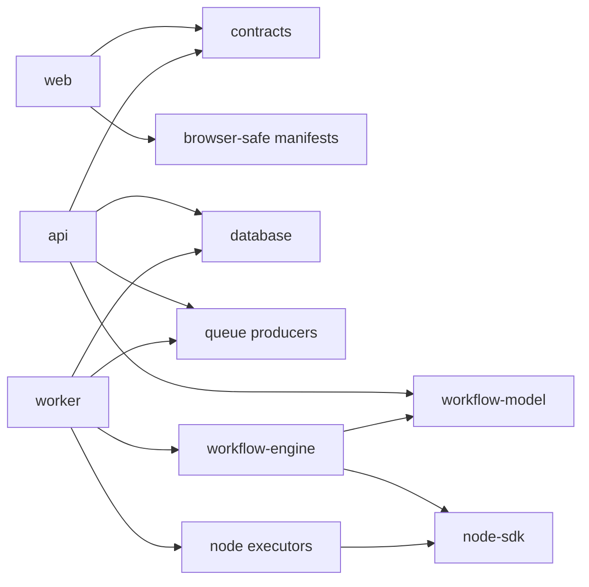
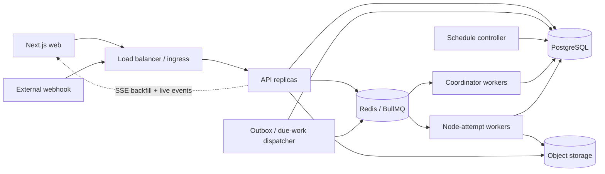
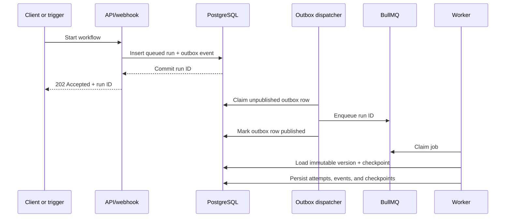

# Workflow Automation Backend Plan

Status: authoritative implementation blueprint after architecture audit and
research-backed decision review

Related research:
[workflow-platform-backend-research.md](./workflow-platform-backend-research.md)

## Product Goal

Build an owned multi-tenant workflow automation platform. The backend model is
designed from the product domain itself; no previous database, API, status
code, collection, or execution convention constrains it. The existing canvas
and node-definition work remains useful as product behavior, but the new
backend becomes authoritative for identity, workflow persistence, versions,
credentials, triggers, executions, artifacts, and operations.

The backend should begin as a modular system with separately deployable API and
worker processes. It should not begin as dozens of networked microservices.

## Canonical Domain Glossary

These terms are normative. Code, database columns, API contracts, metrics, and
product copy use them consistently.

| Term                 | Meaning                                                                                                                    |
| -------------------- | -------------------------------------------------------------------------------------------------------------------------- |
| **Workspace**        | Tenant and authorization boundary that owns workflows, connections, runs, artifacts, limits, and memberships.              |
| **Workflow**         | Stable user-owned identity and metadata. It is not itself executable.                                                      |
| **Draft**            | The single mutable graph for a workflow, protected by an optimistic revision.                                              |
| **Workflow version** | Immutable, published, executable graph snapshot with pinned node-definition versions.                                      |
| **Node definition**  | Versioned product contract for one node kind: schemas, ports, capabilities, retry class, and executor identity.            |
| **Node instance**    | One configured node inside a draft or workflow version.                                                                    |
| **Run**              | One execution of exactly one immutable workflow version.                                                                   |
| **Node attempt**     | One bounded execution attempt for one logical node instance and branch/iteration scope.                                    |
| **Checkpoint**       | Durable scheduler state from which a run can continue without replaying completed side effects.                            |
| **Trigger**          | Published runtime resource that accepts or discovers an event and requests a run.                                          |
| **Connection**       | Workspace-scoped authorization metadata plus a reference to encrypted credential material.                                 |
| **Artifact**         | Object-storage-backed input, output, or file too large or unsuitable for inline JSON.                                      |
| **Preview run**      | Explicit test execution that may perform real side effects but is isolated from production trigger state and retention.    |
| **Wait**             | Persisted suspension with a PostgreSQL-authoritative resume condition; it occupies no worker slot.                         |
| **Outcome unknown**  | An external side effect may have succeeded, but the platform cannot prove the result safely enough to retry automatically. |

## V1 Product Scope

The initial product is for technical operations and automation teams that
connect SaaS products and HTTP APIs. This target user is an initial product
assumption and must be validated through the first three workflow journeys:

1. Webhook -> validate/map -> condition -> HTTP or Slack action.
2. Schedule -> fetch records -> bounded loop -> transform -> destination.
3. Polling event -> deduplicate -> branch -> actions -> failure notification.

### V1 executable surface

- Triggers: Manual, Webhook, and Schedule. Polling is the first follow-up unless
  the third validation journey proves it is required for launch.
- Core nodes: Set/Map, Validate, Condition, Switch, Wait, bounded For Each,
  bounded Parallel, Merge, and Terminate.
- Actions: generic HTTP Request, Slack message, and email notification.
- Outputs: structured result and failure notification.
- Workflows are directed acyclic graphs. Repetition exists only through an
  explicit bounded loop node with a scoped body.
- Webhooks durably accept a run and return `202 Accepted`; they do not hold the
  HTTP connection open for workflow completion.

### Architecture required from the beginning

- Workspace isolation, authorization, PostgreSQL RLS, immutable workflow
  versions, executor pinning, transactional outbox, idempotency records,
  checkpoints, separate node-attempt jobs, bounded payloads, artifacts,
  cancellation, fair admission, and reconstructable run events.
- Node and provider contracts remain extensible, but only completed V1 slices
  are registered as publishable.
- API and worker are separate process roles. Scheduler and outbox duties may
  run as worker profiles until scale or failure isolation justifies another
  deployment.

### Explicitly deferred product features

- Arbitrary user code and its sandbox infrastructure.
- Human approvals and external resume forms.
- Hosted form, Google Form, and Typeform trigger products.
- Nested/sub-workflows and recursive execution.
- Synchronous webhook responses.
- Real-time multiplayer graph editing.
- Broad vendor catalog, database/cloud/CRM suites, browser automation, and
  dedicated provider worker pools.
- Multi-region active-active operation and contractual customer SLAs.

Deferred features may influence stable contracts where the cost is negligible,
but they do not justify V1 tables, queues, deployments, adapters, or empty
interfaces.

### Repository delivery boundary

This checkout deliberately delivers the backend platform only. The web client
is deferred outside this repository's current scope. References to a future
`apps/web` describe a possible consumer topology, not a required V1 workspace;
do not create an empty package or browser-owned contracts merely to match that
illustration.

## Initial Engineering Envelope

These are V1 design and load-test assumptions, not public limits or sales
promises. Entitlements own the enforceable values so they can evolve without
changing executor code.

| Dimension                 |           Initial envelope |
| ------------------------- | -------------------------: |
| Workspaces                |                      1,000 |
| Workflows                 |                     25,000 |
| Active triggers           |                     10,000 |
| Runs per day              |                    100,000 |
| Sustained run starts      |                  10/second |
| Burst run starts          | 50/second for five minutes |
| Nodes per workflow        |                        100 |
| Loop iterations per run   |                      1,000 |
| Inline node input/output  |                    256 KiB |
| Workflow graph snapshot   |                      1 MiB |
| Active execution duration |                     1 hour |
| Durable wait duration     |                    30 days |

Files and larger payloads use object storage. Phase 0 benchmarks must validate
at least twice the sustained run-start target without violating the initial
SLOs or fairness rules.

## Architecture Invariants

These rules are more important than any individual framework choice:

1. The API never executes production workflow nodes.
2. Workers never expose product HTTP endpoints.
3. PostgreSQL is authoritative. Redis and BullMQ transport immediate work and
   low-latency notifications; they are rebuildable and never authoritative for
   workflow state, waits, run history, or schedules.
4. Every run references one immutable workflow version.
5. Draft state, published state, and runtime state are separate models.
6. Node definitions, node instances, and node attempts are separate concepts.
7. Credentials are referenced by ID and never embedded in graph JSON.
8. Queue messages contain identifiers, not graphs, files, or secrets.
9. The execution engine imports no NestJS, database, Redis, or HTTP code.
10. Cross-module work goes through a narrow application capability or a domain
    event, never another module's repository. An interface is introduced only
    at a real substitution, process, persistence, or external-system seam.
11. External side effects are at-least-once unless the provider supports an
    idempotency key; the product never claims magical exactly-once behavior.
12. A wait or delayed retry releases its worker slot and is resumed from
    PostgreSQL-authoritative state.
13. Unsafe side effects are never automatically retried after dispatch; an
    ambiguous provider outcome becomes `outcome_unknown`.
14. Domain statuses and transition policies belong to their owning domain.
    Public contracts expose only the subset clients need.
15. Arbitrary graph cycles are invalid. Only explicit bounded loop definitions
    may repeat work.

## Recommended Stack

- **Language:** TypeScript across web, API, engine, node SDK, and workers.
- **API:** NestJS with the Fastify adapter, deployed separately from Next.js.
- **Database:** PostgreSQL as the durable source of truth.
- **Database access:** Drizzle plus explicit SQL for leases, outbox operations,
  JSONB indexes, and `SKIP LOCKED` work where needed.
- **Queue and live coordination:** Redis plus BullMQ for immediate transport
  and low-latency notifications; PostgreSQL owns durable scheduling.
- **Files and large outputs:** S3-compatible object storage.
- **Contracts:** Zod schemas at HTTP, queue, node-definition, and event seams.
- **Observability:** OpenTelemetry traces, structured logs, and Prometheus-style
  metrics from API, dispatcher, trigger controller, and workers.

NestJS is recommended here because the backend now has enough domains to
benefit from explicit modules, dependency injection, guards, lifecycle hooks,
OpenAPI generation, and testable adapters. Fastify keeps the HTTP layer lean.
The execution engine remains framework-independent.

## Repository And Deployment Shape

Use one monorepo so the API and workers consume the exact same workflow model,
node contracts, and event contracts, while still deploying as separate
services.

```txt
apps/
  web/                    # existing Next.js product UI
  api/                    # REST API, auth, webhooks, SSE, control plane
  worker/                 # workflow coordinator and node-attempt workers

packages/
  contracts/              # public HTTP/event schemas; no global domain bucket
  database/               # schema, migrations, transactions, repository adapters
  workflow-model/         # graph, versions, validation, mappings, expressions
  workflow-engine/        # scheduler/interpreter; no HTTP or ORM imports
  node-sdk/                # node definition and executor interfaces
  nodes-core/              # trigger, logic, transform, and output nodes
  integrations/           # provider packages; manifests and server executors split
  queue/                   # job contracts and BullMQ adapters
  observability/           # tracing, metrics, structured logging
```

The backend is separate because `apps/api` and `apps/worker` are independent
deployments. Keeping them in the same repository avoids publishing and
coordinating private packages while the domain is evolving.

### Complete source layout

The repository should converge on this layout. It is intentionally explicit:
folders communicate runtime ownership, and a generic `utils` or `shared`
dumping ground is not allowed.

```txt
apps/
  web/
    src/                         # Next.js product UI
  api/
    src/
      main.ts
      app.module.ts
      platform/
        auth/                    # guard, actor context, identity provider bootstrap
        config/                  # typed environment schema
        database/                # Drizzle module and transaction context
        health/                  # liveness/readiness checks
        http/                    # request IDs, exception filter, pagination
        observability/           # log/trace/metric bootstrap
        queue/                   # producers only
        storage/                 # object-storage adapter
      modules/                   # capability modules described below
  worker/
    src/
      main.ts
      worker.module.ts
      consumers/                 # thin BullMQ consumers
      runtime/                   # worker bootstrap, shutdown, lease heartbeat

packages/
  contracts/src/
    http/                        # public request/response schemas
    errors/                      # public problem codes and problem schema
    statuses/                    # public status representations only
    pagination/                  # cursor contracts
  database/src/
    schema/
      identity.ts
      workspaces.ts
      workflows.ts
      connections.ts
      triggers.ts
      executions.ts
      artifacts.ts
      platform.ts
    migrations/                  # generated SQL, reviewed and committed
    repositories/                # reusable SQL mechanics, not domain use cases
    transactions/                # transaction and tenant-context helpers
  workflow-model/src/
    graph/                        # graph contracts and graph invariants
    validation/                   # publish/runtime validation
    mapping/                      # value sources and JSON-path resolution
    expressions/                  # parser and evaluator
    versions/                     # schema/config migrations
    statuses/                     # workflow-owned status constants and policy
  workflow-engine/src/
    scheduler/                    # ready-set and branch/join scheduling
    runtime/                      # engine interfaces and state transitions
    checkpoints/                  # serializable scheduler state
    retries/                      # retry classification and backoff
    events/                       # engine event production
    statuses/                     # run/attempt-owned status constants and policy
  node-sdk/src/
    definitions/                  # manifest contracts
    executors/                    # executor interfaces
    triggers/                     # lifecycle adapter interfaces
    credentials/                  # opaque credential requirement contracts
    testing/                      # definition/executor contract harnesses
  nodes-core/src/<family>/<node>/
    definition.ts
    executor.ts
    validation.ts                 # only when definition schema is insufficient
    index.ts
  integrations/<provider>/src/
    manifest.ts                   # browser-safe metadata export
    operations/                   # operation schemas
    credentials/                  # credential schema, never secret values
    server/                       # provider client and executors, server-only export
    testing/                      # provider contract fixtures
  queue/src/
    contracts/                    # versioned job schemas
    names.ts                      # queue/job constants
    producers/                    # enqueue interfaces and BullMQ adapter
    workers/                      # shared worker defaults
  observability/src/
    logging/
    metrics/
    tracing/
```

### Package dependency rules



- `workflow-model`, `workflow-engine`, and node definitions contain no NestJS,
  Drizzle, Redis, BullMQ, or browser imports.
- `contracts` contains no ORM records, server implementation types, or
  canonical domain status ownership. It exposes versioned public wire shapes.
- `web` can import public contracts and browser-safe manifests only. Package
  export maps must make server executor paths impossible to resolve in a
  browser build.
- `api` can enqueue work but cannot import worker consumers or execute nodes.
- `worker` calls application services and engine ports; consumers do not own
  business logic.
- A module never imports another module's repository. It calls a narrow
  application capability or reacts to a domain/outbox event. Do not create a
  facade merely to wrap one local function.
- Domain types are not named `Dto`, and HTTP DTOs never become database row
  types by convenience.
- A helper stays beside its owner. Shared extraction requires at least two
  real callers with the same semantics, not merely similar-looking code.
- Package root barrels expose deliberate public APIs only. They must not
  recursively export every file.

## NestJS Application Structure

The API is a modular monolith. Modules are organized by product capability,
not by global `controllers`, `services`, and `repositories` folders.

```txt
apps/api/src/
  main.ts
  app.module.ts

  platform/
    config/
    database/
    queue/
    observability/
    health/

  modules/
    identity/
    workspaces/
    workflows/
    node-catalog/
    connections/
    triggers/
    executions/
    artifacts/
    audit/
    usage/
```

Each substantial module may use this shape when it has enough behavior to
justify every layer:

```txt
workflows/
  workflows.module.ts
  domain/                 # entities, value objects, policies, owned statuses
  application/            # use cases; ports only at meaningful seams
  infrastructure/         # PostgreSQL repositories and external adapters
  http/                   # controllers, request/response schemas
```

Small modules stay shallow. Empty layers, one-implementation repositories,
pass-through facades, and interfaces created only for mocking are not accepted.

### NestJS dependency rules

- Controllers call application use cases; they do not query Drizzle directly.
- Application use cases depend on ports for PostgreSQL persistence, queues,
  object storage, identity, clocks/ID sources, and external providers. Local
  pure collaborators remain concrete functions or modules.
- Infrastructure adapters implement only those meaningful ports.
- Domain code has no Nest decorators.
- Modules export only the application capabilities another module genuinely
  calls, not all internal providers or a mandatory facade object.
- Request-scoped providers are avoided unless request context genuinely
  requires them; tenant and actor context is passed explicitly.
- One global exception filter maps domain/application errors into the public
  error contract.
- One authentication guard establishes the actor; module policies perform
  authorization for the requested workspace resource.
- Circular `forwardRef()` module graphs are considered an architecture defect,
  not the normal solution.

### Coding and configuration rules

- Before Phase 0 TypeScript work, the implementing engineer or agent must consult
  the locally available `typescript-advanced-types`, `codebase-design`, `tdd`,
  and, when terminology changes, `domain-modeling` guidance. The
  `improve-codebase-architecture` guidance is used for later structural audits,
  not as permission to add speculative seams before implementation. These
  guides govern code mechanics and test design; they do not override the
  distributed-system, persistence, queue, security, or product decisions in
  this blueprint and its ADRs.
- Prefer the simplest type that makes an invalid architectural state difficult
  to represent. Advanced conditional, recursive, branded, or builder types are
  introduced only when they remove demonstrated caller complexity. Type-system
  cleverness is not an architectural objective.
- Constants use `as const` and inferred union types. TypeScript enums and
  repeated domain string/number literals are not used.
- Environment variables are parsed once during bootstrap into a typed,
  immutable config object. Missing or invalid required configuration fails
  startup; feature-optional provider configuration disables only that adapter.
- Timeouts, limits, retry policies, queue names, event names, scopes, and status
  values have named owners. Numeric literals are acceptable only when their
  meaning is local and obvious.
- Functions do one job and return early for invalid preconditions. Avoid nested
  condition trees, chained ternaries, boolean parameter lists, and generic
  option bags.
- Prefer discriminated unions and exhaustive `switch` statements for domain
  variants. An `assertNever` helper belongs in one small language-level module,
  not in a domain-status catalog.
- Use plain functions for pure policies and transformations. Use classes when
  Nest lifecycle/DI or a stateful adapter genuinely requires one; do not wrap
  every function in a service class.
- Comments explain a constraint or non-obvious decision, never narrate syntax.
- Filenames name the capability (`publish-workflow.ts`,
  `workflow-draft.repository.ts`), not vague buckets such as `helpers.ts`,
  `manager.ts`, or `common.ts`.
- A use-case file contains its input/output contract and orchestration. Move a
  policy only when it has independent domain meaning or multiple callers.
- Static dependency checks enforce package direction and server-only export
  boundaries in CI.

#### TypeScript compiler baseline

The new backend workspace owns a root `tsconfig.base.json`. Application,
package, migration, script, and test configs extend it rather than maintaining
independent strictness policies. The baseline enables at least:

```json
{
  "compilerOptions": {
    "strict": true,
    "noUncheckedIndexedAccess": true,
    "exactOptionalPropertyTypes": true,
    "useUnknownInCatchVariables": true,
    "noImplicitOverride": true,
    "noFallthroughCasesInSwitch": true,
    "noImplicitReturns": true,
    "forceConsistentCasingInFileNames": true,
    "isolatedModules": true,
    "verbatimModuleSyntax": true
  }
}
```

Build-specific options such as `module`, `moduleResolution`, output paths, and
`noEmit` belong in child configs. A package may not weaken these safety flags
without a documented tool-compatibility reason and a narrowly scoped config.
Tests are type-checked by a test config; excluding test files from the
production build must not exclude them from CI type checking.

#### Type modeling and inference

- Model genuine variants and lifecycle states as discriminated unions with a
  stable literal discriminator such as `kind`, `type`, or `status`. Do not model
  one state as a bag of unrelated booleans and optional fields.
- Handle closed unions exhaustively. Domain decisions use an exhaustive
  `switch` and the shared `assertNever` at the unreachable branch. A newly added
  status or job kind must produce compile failures at every incomplete handler;
  there is no permissive `default` for known domain variants.
- Transition tables and handler registries use `satisfies Record<Union, ...>` so
  completeness is checked without widening literal keys or values.
- Prefer inference for local variables, return values of private pure helpers,
  and generic type arguments. Exported module interfaces, application use cases,
  ports, queue handlers, and public package functions declare their parameter
  and return contracts explicitly so accidental API drift is visible in review.
- Use `readonly` arrays/properties at interfaces that promise not to mutate
  caller-owned data. Do not add recursive `DeepReadonly` or branded-ID systems
  until a concrete bug class justifies their cost.
- Use purpose-built domain and read-model types. Do not pass Drizzle row types,
  Nest DTO classes, Zod internals, or provider SDK response types across module
  interfaces.

#### Schema and type boundaries

- Every untrusted value starts as `unknown`. Zod parses HTTP input, environment
  variables, queue payloads, database JSON, external provider responses, node
  configuration, imported fixtures, and persisted versioned envelopes at the
  adapter edge.
- For wire/configuration contracts, the Zod schema is the runtime source of
  truth and TypeScript types are inferred from it. Use `z.input<typeof Schema>`
  and `z.output<typeof Schema>` when coercion or transformation makes those
  shapes differ; do not pretend they are the same type.
- A domain type may remain separate from its transport schema when it expresses
  stronger invariants or behavior. In that case, one explicit mapper crosses
  the seam and tests prove the mapping; do not force a schema annotation merely
  to make two independently maintained definitions appear synchronized.
- Parse once at the owning seam. Downstream functions accept the parsed type and
  do not repeat defensive object-shape checks. Simple internal narrowing may use
  a type predicate; external object validation uses its schema.
- Public write schemas reject unexpected keys unless the contract explicitly
  defines an extension object. Dynamic JSON uses an explicit `JsonValue` model
  or `Record<string, unknown>` at the narrow location that owns it, never as a
  substitute for an unknown domain shape.
- `safeParse` is used when invalid input is an expected response that must be
  mapped into the public error contract. Bootstrap may use throwing parse when
  invalid configuration must terminate startup.
- Do not duplicate validation in Zod, decorators, and ad hoc guards. Nest uses a
  single Zod-backed request boundary; OpenAPI generation must consume the same
  contract or a mechanically verified projection of it.

#### Errors and results

- Expected alternatives that a caller must branch on use a small discriminated
  result, for example `{ ok: true, value } | { ok: false, error }`. Never return
  `T | Error`, `null` for failure, or an object with unrelated optional
  `data`/`error` fields.
- Do not introduce a Result class, monad, or universal generic result wrapper.
  Define a local result union when one use case needs expected branching; move a
  minimal shared `Result<T, E>` type to a language-level package only after it
  has multiple genuine consumers.
- Application commands return their success contract and throw typed
  domain/application errors for failed commands. The global exception filter
  maps those errors to RFC 9457. Unexpected infrastructure failures remain
  exceptions, retain their `cause`, and are not mislabeled as domain outcomes.
- `catch` values remain `unknown` until narrowed. Provider and queue adapters
  translate foreign errors once into the owned error taxonomy; callers do not
  inspect vendor-specific classes or message strings.
- A state that can truthfully be `outcome_unknown` remains a first-class typed
  variant. It must not be collapsed into generic success/failure for ergonomic
  convenience.

#### Generics, assertions, and unsafe escape hatches

- A generic parameter must express a real relationship between at least two
  positions, preserve caller inference, or power a reused registry. A function
  that merely accepts and returns one concrete domain concept stays concrete.
- Do not create generic repositories, base services, universal command buses,
  recursive path types, or configurable builders for hypothetical reuse. Prefer
  a narrow named module interface and add a seam only when behavior genuinely
  varies.
- Call sites normally rely on inferred generic arguments. Repeated explicit type
  arguments are evidence that the interface is too broad or inference has been
  lost and should be redesigned before adding casts.
- `as const` and `satisfies` are normal modeling tools. `as unknown as`, broad
  assertions, non-null assertions, and `any` are forbidden in domain and
  application code. An unavoidable third-party escape hatch is isolated in its
  adapter, justified with the upstream limitation, narrowed immediately, and
  covered by a runtime contract test.
- Assertion functions are reserved for invariants the program has actively
  checked. They do not replace parsing at untrusted seams or hide nullable
  persistence states.

#### Typed contract testing

- Runtime schema tests cover representative success values, rejected values,
  unknown-key policy, version discriminators, and every coercion/transform.
- Compile-time contract tests use the test runner's type assertions (for example
  `expectTypeOf`) plus intentional `@ts-expect-error` cases. They verify registry
  completeness, union narrowing, schema input/output types, public use-case
  inference, and forbidden invalid variants without inventing a home-grown type
  assertion framework.
- Each `@ts-expect-error` includes the reason and is attached to the exact line
  expected to fail. An unused directive fails CI.
- Runtime behavior is still tested through agreed public module interfaces. Type
  tests complement those tests; they do not inspect private helpers or replace
  database, queue, failure-recovery, and API contract tests.
- Type complexity is a maintained cost. If a type needs extensive explanatory
  prose, noticeably slows type checking, or repeatedly requires assertions at
  callers, simplify the interface instead of adding another utility type.

### Module ownership

| Module       | Owns                                                                             | Does not own                                  |
| ------------ | -------------------------------------------------------------------------------- | --------------------------------------------- |
| Identity     | users, auth identities, sessions, service accounts                               | workspace permissions                         |
| Workspaces   | workspaces, memberships, invitations, roles                                      | authentication credentials                    |
| Workflows    | workflow identity, drafts, versions, validation, publication                     | running executions                            |
| Node catalog | node manifests, versions, schemas, availability                                  | configured node instances                     |
| Connections  | OAuth accounts, API credentials, secret references, health                       | graph configuration                           |
| Triggers     | published webhook/schedule materialization and delivery lifecycle                | graph editing; deferred forms/polling catalog |
| Executions   | admission, runs, node attempts, checkpoints, waits, events, cancellation, replay | workflow publication                          |
| Artifacts    | uploaded files and large run payloads                                            | arbitrary graph JSON                          |
| Audit        | immutable security/product actions                                               | debug logs                                    |
| Usage        | metering and entitlement policy                                                  | fair dispatcher mechanics                     |

### Module application map

| Module       | Primary commands                                                            | Primary queries/events                                          |
| ------------ | --------------------------------------------------------------------------- | --------------------------------------------------------------- |
| Identity     | link identity, create/revoke session, create/revoke API key                 | current actor, service account list; `identity.revoked`         |
| Workspaces   | create workspace, invite/accept/remove member, change role, suspend/archive | workspace/member lists, permissions; membership audit events    |
| Workflows    | create, save draft, validate, publish, archive, restore version             | lists, draft, versions, dependency impact; `workflow.published` |
| Node catalog | register release at bootstrap, deprecate availability                       | manifests, operations, compatible versions                      |
| Connections  | create/update secret version, complete OAuth, test, revoke                  | usable connections and health; `connection.revoked`             |
| Triggers     | reconcile, enable/disable, renew, poll, accept delivery                     | trigger health/delivery history; `trigger.delivery.accepted`    |
| Executions   | accept run, continue checkpoint, cancel, replay                             | run/node/event history; run lifecycle events                    |
| Artifacts    | begin/finalize upload, create output artifact, expire/delete                | artifact metadata and signed download                           |
| Audit        | append immutable audit fact                                                 | scoped cursor history/export                                    |
| Usage        | record idempotent usage, rebuild rollup, enforce entitlement                | period totals, remaining limits, concurrency allowance          |

Command handlers own state changes and publish outbox facts. Query handlers can
use focused SQL read models. This is command/query separation for clarity, not
a requirement to install a CQRS framework or event-source the application.

The worker imports the same application packages but boots a Nest standalone
application context with no HTTP server:

```txt
apps/worker/src/
  main.ts
  worker.module.ts
  consumers/
    workflow-coordinator.consumer.ts
    node-attempt.consumer.ts
    outbox-dispatch.consumer.ts
    trigger-schedule.consumer.ts
```

Consumers should remain thin: validate the job contract, establish tracing,
call one application use case, and acknowledge or reject the job.

## System Topology



### Load balancing

- API replicas receive product traffic and V1 webhooks behind the load
  balancer.
- They are stateless; no sticky session is required.
- Workers are not behind the load balancer. They pull from queues.
- Webhook ingress can split from the API deployment later when trigger volume
  needs independent scaling, without changing application interfaces.
- Database connection pooling is mandatory before adding many replicas.

## Control Plane Modules

### Identity and tenancy

- Users
- Authentication identities and sessions
- Workspaces
- Workspace memberships and roles
- API keys and service accounts
- Invitations
- Audit log

Authentication uses one managed, standards-compatible OIDC provider rather
than custom password cryptography. Keep its SDK inside the identity
infrastructure module; do not build a speculative multi-provider abstraction.
The platform owns authorization, `users`, `workspaces`, memberships, and the
mapping from external subject to internal user ID. Browser authentication uses
an HTTP-only secure session cookie; service accounts use scoped API
credentials.

### Workflow management

- Workflow identity and metadata
- Mutable draft with optimistic revision
- Immutable published versions
- Ownership and permissions
- Validation reports
- Tags, folders, import/export, and templates are follow-up product slices.
- Sub-workflows are explicitly deferred.

### Integration catalog

- V1 operations for HTTP, Slack, and email
- Trigger/action classification
- Versioned config, input, and output schemas
- Credential requirements
- Dynamic option resolvers only where a V1 provider requires them
- Node availability and deprecation state

### Connections and secrets

- OAuth connections
- API-key and credential connections
- Secret references
- Connection sharing and workspace permissions
- Connection health and reauthorization status

### Execution operations

- Runs and node attempts
- Cancellation
- Retry and replay
- Live events
- Run retention
- Usage and quotas
- Dead-letter and failed-run operations

The catalog remains extensible, but a provider or node is not publishable until
its definition, executor, credentials, retry classification, observability,
and contract tests are complete.

## Persistence Model

### Database conventions

- Use UUIDv7 identifiers generated by the application for sortable distributed
  IDs.
- Put `workspace_id` directly on tenant-owned tables, even when it could be
  reached through another join. This makes authorization and indexes explicit.
- Use `timestamptz` and server-side timestamps.
- Use cursor pagination for unbounded registries and execution history.
- Prefer hard deletion for mutable drafts and revocable connection metadata;
  preserve immutable versions, runs, audit records, and billing records through
  retention policies.
- Add foreign keys and unique constraints for invariants; do not rely only on
  application checks.
- Introduce time partitioning for run events and node attempts only after table
  size and retention measurements justify it.
- Define every foreign-key delete behavior explicitly. Immutable operational
  history normally uses `RESTRICT`; replace user display data with tombstoned
  metadata rather than cascading away run history.
- Every tenant query includes `workspace_id`, even when the ID is globally
  unique. Repository methods require workspace scope in their signature.
- Use PostgreSQL row-level security with `FORCE ROW LEVEL SECURITY` as defense
  in depth on tenant tables. API and worker transactions set
  `app.workspace_id` with `SET LOCAL`; migration and maintenance roles are
  separate from runtime roles and own the tables.
- Drizzle schema definitions and reviewed SQL migrations are the schema source
  of truth. Production never uses schema push/synchronization commands.
- Use `jsonb` for coherent graph snapshots and variable payloads, not as an
  excuse to avoid modeled columns, foreign keys, checks, or indexes.

### Entity catalog

This catalog describes the target persistence boundary. Only entities named by
the current delivery slice are created in V1 migrations; deferred entities are
called out explicitly. Code registries, temporary view models, and cache
entries are not database entities.

#### Identity and workspace entities

| Entity                   | Important fields                                                                     | Invariants and indexes                                           |
| ------------------------ | ------------------------------------------------------------------------------------ | ---------------------------------------------------------------- |
| `users`                  | `id`, `email`, `display_name`, `status`, timestamps                                  | case-insensitive unique email; status check                      |
| `auth_identities`        | `id`, `user_id`, `provider`, `provider_subject`, profile metadata                    | unique `(provider, provider_subject)`                            |
| `sessions`               | `id`, `user_id`, hashed token, `expires_at`, `revoked_at`, client metadata           | token digest unique; expiry index; never store raw session token |
| `service_accounts`       | `id`, `workspace_id`, `name`, `status`, `created_by`                                 | unique active name per workspace                                 |
| `api_keys`               | `id`, `service_account_id`, prefix, secret hash, scopes, expiry/revocation           | prefix index; raw key returned once only                         |
| `workspaces`             | `id`, `name`, `slug`, `status`, `deletion_requested_at`, `purge_after`, timestamps   | unique slug; status check; pending-purge index                   |
| `workspace_memberships`  | `workspace_id`, `user_id`, `role`, `status`, timestamps                              | unique `(workspace_id, user_id)`; workspace/status index         |
| `workspace_invitations`  | `id`, `workspace_id`, email, role, token hash, expiry, accepted timestamp            | one pending invitation per workspace/email                       |
| `workspace_entitlements` | `workspace_id`, plan/source reference, versioned limits JSON, effective/expiry times | one effective entitlement version at a time                      |

V1 uses fixed role constants (`owner`, `admin`, `builder`, `operator`,
`viewer`) and permission-policy functions. A roles table is not added until
custom roles become a product requirement.

#### Workflow authoring entities

| Entity                       | Important fields                                                                                                      | Invariants and indexes                                               |
| ---------------------------- | --------------------------------------------------------------------------------------------------------------------- | -------------------------------------------------------------------- |
| `workflows`                  | `id`, `workspace_id`, `name`, `lifecycle_status`, `activation_status`, `published_version_id`, timestamps             | workspace/name index; published pointer references same workflow     |
| `workflow_drafts`            | `workflow_id`, `revision`, `schema_version`, `graph_json`, `updated_by`, `updated_at`                                 | exactly one draft per workflow; revision is optimistic lock          |
| `workflow_versions`          | `id`, `workspace_id`, `workflow_id`, `version_number`, `schema_version`, `graph_json`, `checksum`, publish actor/time | unique `(workflow_id, version_number)` and `(workflow_id, checksum)` |
| `workflow_integration_usage` | `workflow_version_id`, `provider_key`, `operation_key`, `connection_id`                                               | indexes for impact and connection revocation queries                 |

`folder_id` is omitted from the V1 `workflows` table. Folders, tags,
templates, and workflow dependencies are added only with their deferred
product slices. Sub-workflow dependencies must not appear before nested
workflows are accepted into scope.

`workflow_integration_usage` is a projection of an immutable version. It is
rebuilt in the publish transaction and can be recreated from `graph_json`; it
never overrides the graph. `workflow_dependencies` follows only when nested
workflows enter scope.

#### Connection and secret entities

| Entity                       | Important fields                                                                                            | Invariants and indexes                                                 |
| ---------------------------- | ----------------------------------------------------------------------------------------------------------- | ---------------------------------------------------------------------- |
| `connections`                | `id`, `workspace_id`, `provider_key`, `name`, `auth_type`, `status`, `secret_version_id`, health timestamps | unique active name/provider per workspace; no plaintext secret columns |
| `connection_secret_versions` | `id`, `connection_id`, encrypted data key, ciphertext, nonce/tag, KMS key reference, created actor/time     | immutable versions; current pointer belongs to connection              |
| `oauth_transactions`         | `id`, `workspace_id`, provider, state hash, PKCE verifier ciphertext, redirect URI, expiry                  | unique state hash; short retention; single use                         |
| `connection_events`          | `id`, `workspace_id`, `connection_id`, event type, safe metadata, created time                              | append-only health/auth history                                        |

Secret ciphertext may live in PostgreSQL initially, but encryption uses
envelope encryption with a managed KMS. Workflow JSON stores only a
`connectionId`; logs, events, API responses, and queue jobs never contain
plaintext credentials.

#### Trigger entities

| Entity               | Important fields                                                                                                                  | Invariants and indexes                                     |
| -------------------- | --------------------------------------------------------------------------------------------------------------------------------- | ---------------------------------------------------------- |
| `workflow_triggers`  | `id`, `workspace_id`, `workflow_id`, `workflow_version_id`, `node_id`, `kind`, `status`, config fingerprint, health/error summary | unique `(workflow_version_id, node_id)`; active-kind index |
| `trigger_endpoints`  | `trigger_id`, opaque endpoint key, signature secret reference, response policy                                                    | endpoint key unique and unguessable                        |
| `trigger_schedules`  | `trigger_id`, cron/interval, timezone, next/last fire, misfire policy, lease fields                                               | due-time partial index for active schedules                |
| `trigger_deliveries` | `id`, `workspace_id`, `trigger_id`, external delivery ID, received time, payload reference, run ID                                | unique provider delivery identity for deduplication        |

These are materialized runtime resources for the currently published version.
They are reconciled after publication and never edited directly by the canvas.
`trigger_subscriptions` and `trigger_cursors` are deferred with connected-app
and polling triggers.

#### Execution entities

| Entity                | Important fields                                                                                                                  | Invariants and indexes                                     |
| --------------------- | --------------------------------------------------------------------------------------------------------------------------------- | ---------------------------------------------------------- |
| `workflow_runs`       | identity/scope, pinned workflow version, origin/trigger, status, input/output references, timestamps, cancellation, error summary | workspace/status/created index                             |
| `node_runs`           | run ID, node ID, invocation key, branch/iteration context, status, input/output refs, timestamps                                  | unique `(workflow_run_id, invocation_key)`                 |
| `node_attempts`       | node run ID, attempt number, worker/lease data, status, retry decision, safe error, timestamps                                    | unique `(node_run_id, attempt_number)`                     |
| `run_events`          | run ID, monotonic sequence, event type, node/invocation IDs, bounded payload, created time                                        | unique `(workflow_run_id, sequence)`; append-only          |
| `run_checkpoints`     | run ID, revision, engine version, scheduler state, resume time, updated time                                                      | one current checkpoint per run; due-resume index           |
| `idempotency_records` | workspace, operation, scope, key hash, canonical request hash, status, resource/result reference, expiry, timestamps              | unique active `(workspace_id, operation, scope, key_hash)` |

`node_runs` represents one logical invocation, including a loop iteration or
branch instance. `node_attempts` represents retries of that invocation. This
keeps retry history truthful instead of overwriting an `attempt` column.
`idempotency_records` owns request deduplication for run acceptance, webhook
delivery, publish, replay, and destructive commands. Reusing one key with a
different canonical request hash returns `request.idempotency_conflict`.
Expiry is an explicit lifecycle operation; it is not inferred from deleting a
run row.

#### Artifact, audit, usage, and platform entities

| Entity           | Important fields                                                                                                                | Invariants and indexes                                    |
| ---------------- | ------------------------------------------------------------------------------------------------------------------------------- | --------------------------------------------------------- |
| `artifacts`      | `id`, `workspace_id`, purpose, storage key, media type, byte size, checksum, status, retention/deletion times                   | storage key unique; workspace/status index                |
| `artifact_links` | artifact ID, run/node/trigger owner kind and ID                                                                                 | artifact owner index; no polymorphic cascade              |
| `audit_events`   | workspace, actor, action, target, request/trace IDs, safe before/after metadata, timestamp                                      | append-only; workspace/time index                         |
| `usage_events`   | workspace, category, quantity, run/node reference, occurred time                                                                | idempotency key unique; period index                      |
| `usage_rollups`  | workspace, category, period, total, updated time                                                                                | unique workspace/category/period; derived and rebuildable |
| `outbox_events`  | ID, topic, aggregate identity, versioned payload, availability, lease, attempt, publication/failure timestamps, last safe error | unpublished/due partial index                             |
| `inbox_receipts` | consumer, message ID, payload checksum, received/completed timestamps                                                           | unique `(consumer, message_id)`                           |

Object storage upload bodies bypass the API through short-lived signed URLs.
The API creates/finalizes artifact metadata and verifies expected size,
checksum, content type, and workspace ownership.

### Canonical statuses and transitions

Do not use one generic status enum. Each lifecycle has its own vocabulary and
transition policy. The values are declared once as literal constants, then
reused by TypeScript types, Zod schemas, database checks, jobs, events, and UI.

```ts
export const RUN_STATUS = {
  queued: "queued",
  running: "running",
  waiting: "waiting",
  succeeded: "succeeded",
  failed: "failed",
  canceled: "canceled",
  timedOut: "timed_out",
  outcomeUnknown: "outcome_unknown",
} as const

export type RunStatus = (typeof RUN_STATUS)[keyof typeof RUN_STATUS]
export const RUN_STATUS_VALUES = Object.values(RUN_STATUS) as [
  RunStatus,
  ...RunStatus[],
]
```

| Lifecycle                  | Values                                                                                                                 |
| -------------------------- | ---------------------------------------------------------------------------------------------------------------------- |
| User                       | `active`, `suspended`, `deleted`                                                                                       |
| Workspace                  | `active`, `suspended`, `pending_deletion`, `purging`, `deleted`                                                        |
| Membership/service account | `invited`, `active`, `suspended`, `removed`                                                                            |
| Invitation                 | `pending`, `accepted`, `expired`, `revoked`                                                                            |
| Workflow lifecycle         | `active`, `archived`                                                                                                   |
| Workflow activation        | `inactive`, `activating`, `active`, `deactivating`, `degraded`, `error`                                                |
| Connection                 | `pending`, `connected`, `reauthorization_required`, `revoked`, `error`                                                 |
| Trigger                    | `pending`, `active`, `degraded`, `disabled`, `error`                                                                   |
| Workflow run               | `queued`, `running`, `waiting`, `succeeded`, `failed`, `canceled`, `timed_out`, `outcome_unknown`                      |
| Node run/attempt           | `pending`, `ready`, `running`, `waiting`, `succeeded`, `failed`, `skipped`, `canceled`, `timed_out`, `outcome_unknown` |
| Artifact                   | `pending`, `available`, `failed`, `deleted`                                                                            |
| Idempotency record         | `in_progress`, `completed`, `failed`, `expired`                                                                        |

Every lifecycle package exports an allowed-transition map and an
`assert...Transition` policy. Use cases call that policy inside the same
transaction as the update. Terminal execution statuses cannot transition.
Activation status is deliberately separate from workflow lifecycle: archiving
a workflow and reconciling its external triggers are different operations.
`outcome_unknown` is terminal until an operator records a reconciliation
decision; it never enters the automatic retry transition map.

#### Normative transition rules

- Workflow lifecycle: `active -> archived`; restore creates
  `archived -> active`. Archiving requests trigger deactivation but does not
  rewrite published versions or completed runs.
- Workflow activation: `inactive -> activating -> active`; deactivation uses
  `active|degraded|error -> deactivating -> inactive`. Reconciliation failure
  produces `degraded` when some triggers remain usable and `error` when none
  can be trusted.
- Run acceptance creates `queued`. The coordinator alone transitions
  `queued -> running`, `running <-> waiting`, or a nonterminal run to a terminal
  status. Cancellation first records `cancel_requested` as durable metadata;
  the terminal status changes only after scheduling has stopped and active
  attempts are reconciled.
- A node invocation moves `pending -> ready` only from a coordinator decision.
  A node worker moves one admitted attempt `ready -> running` and records one
  terminal outcome. Retry creates a new attempt row; it never moves a failed
  attempt back to running.
- `succeeded`, `failed`, `canceled`, `timed_out`, and `outcome_unknown` are
  terminal facts. Operator reconciliation of `outcome_unknown` appends evidence
  and may create a replay; it does not rewrite the original outcome.
- Skipping is a coordinator decision for unreachable/disabled invocations, not
  a worker result.
- An idempotency record is claimed as `in_progress` in the command transaction,
  then becomes `completed` with its result reference or `failed` with a safe
  retry policy. Expiry is a maintenance transition after the operation-specific
  replay window; an active record is never overwritten by a different request
  hash.

Hard-coded domain strings outside these constant modules fail lint through a
restricted-syntax rule where practical. Database values remain readable text
with `CHECK` constraints rather than PostgreSQL enums, allowing staged status
migrations without replacing database types.

### Workflow definitions

Do not reproduce `workflow_steps`, `node_vals`, and `connectors` as the primary
domain model. Store the graph atomically as versioned JSONB.

```txt
workflows
  id, workspace_id, name, lifecycle_status, activation_status,
  published_version_id, created_by, timestamps

workflow_drafts
  workflow_id, revision, graph_json, schema_version, updated_by, updated_at

workflow_versions
  id, workflow_id, version_number, graph_json, schema_version, checksum,
  published_by, published_at
```

Benefits:

- Publishing is one immutable snapshot operation.
- A run always sees a coherent graph.
- Node movement or one config edit does not require many table writes.
- Version comparison and restore are straightforward.
- The graph model matches what the editor and engine consume.

V1 derived tables support queries that JSONB snapshots are poor at:

```txt
workflow_integration_usage
workflow_triggers
```

These are rebuilt transactionally when a draft is published. They are indexes,
not competing sources of graph truth.

### Canonical workflow graph contract

The graph contract is owned by `workflow-model`, versioned independently from
API versions, and parsed at every persistence/runtime seam.

```ts
type WorkflowGraph = {
  schemaVersion: number
  nodes: WorkflowNode[]
  edges: WorkflowEdge[]
  settings: WorkflowSettings
}

type WorkflowNode = {
  id: string
  definition: { key: string; version: number }
  position: { x: number; y: number }
  configVersion: number
  config: Readonly<Record<string, unknown>>
  inputMappings: Readonly<Record<string, ValueSource>>
  connectionRefs: Readonly<Record<string, string>>
  label?: string
  disabled?: boolean
}

type WorkflowEdge = {
  id: string
  source: { nodeId: string; port: string }
  target: { nodeId: string; port: string }
}

type ValueSource =
  | { kind: "literal"; value: unknown }
  | { kind: "run_input"; path: string }
  | { kind: "node_output"; nodeId: string; path: string }
  | { kind: "expression"; language: "jsonata"; expression: string }
```

- Node IDs and edge IDs are stable within a workflow version and client-
  generated so offline draft commands remain addressable.
- `position` is authoring metadata, not execution logic.
- A mapping explicitly names its source node and path. Execution never guesses
  from labels, display order, or the most recently executed node.
- Connections are opaque references. Raw credential material is rejected from
  graph JSON by schema and a publish-time secret scan.
- Node config migrations are pure functions from one `configVersion` to the
  next. Published snapshots are not mutated; the worker can execute retained
  versions through compatible executors or an explicit runtime migration.
- Canonical JSON serialization sorts object keys before checksum calculation.
- Limits cover node/edge count, graph byte size, expression length, mapping
  depth, and fan-out. The editor receives the same limit constants.
- Unknown definition versions make a draft readable but not publishable. They
  never silently fall back to the latest executor.
- JSONata is the only V1 expression language. Evaluation receives an explicit
  immutable context, no host objects, no network/filesystem access, and no
  arbitrary registered functions. `$eval` is unavailable. Publish validation
  enforces expression length/depth, and runtime evaluation enforces time and
  output-size limits.

Draft writes send the coherent graph plus `expectedRevision`; they do not
translate every canvas gesture into database rows. The UI may keep command
history and send patches over time later, but PostgreSQL still stores one
authoritative draft snapshot and revision.

### Node definitions

Platform nodes live in a versioned code registry. Searchable metadata may be
synced into PostgreSQL, but the executable contract is released with the
backend/worker artifact.

Each definition pins:

```ts
type NodeDefinition = {
  key: string
  version: number
  family: "trigger" | "action" | "logic" | "transform" | "output"
  configSchema: unknown
  inputSchema: unknown
  outputSchema: unknown
  ports: unknown
  credentialRequirements: unknown
  retryClass: "safe" | "idempotent-with-key" | "unsafe"
  resourceClass: "io" | "cpu"
  executor: string
}
```

Workflow nodes store `definitionKey` and `definitionVersion`. Existing
published versions therefore remain executable after a node definition evolves.

Integration operations should usually use one generic integration node shape,
not a custom React component and scheduler for every operation. Specialized UI
is reserved for genuinely different interactions.

The node registry has three layers:

1. **Manifest:** searchable product metadata, schemas, ports, credentials, and
   capabilities.
2. **Executor:** server-only implementation selected by manifest key/version.
3. **Instance:** user configuration stored inside a workflow graph snapshot.

The browser receives manifests but never executor code. Workers receive the
registry release containing all executable versions still referenced by
retained workflow versions.

### Node and executor compatibility policy

- A published workflow version pins every node definition and executor
  version. Workers never substitute the latest version at runtime.
- An executor version remains deployable while referenced by an active
  published workflow, a nonterminal run, or a run still eligible for replay.
- Deprecation first blocks new placement, then warns affected workflows, then
  requires an explicit draft migration and republish. Immutable versions are
  never rewritten.
- A version can be removed only after a dependency query proves no executable
  reference remains. Historical run data stays readable after replay support
  expires.
- Rolling deployments accept current and previous queue/event schemas, but
  that rollout window does not replace executor compatibility policy.
- Retained workflow fixtures in CI prove that every supported executor version
  can still validate and execute.

Future resource classes such as isolated code, browser, and GPU require their
own ADR, security boundary, deployment pool, and complete vertical slice; they
are not V1 enum values or worker dependencies.

### Integration package contract

Each provider package follows the same shape but does not inherit a giant base
class. Shared behavior is composed from HTTP, OAuth, pagination, rate-limit,
and credential helpers.

```ts
type IntegrationManifest = {
  key: string
  version: number
  displayName: string
  auth: readonly AuthDefinition[]
  operations: readonly OperationManifest[]
  triggers: readonly TriggerManifest[]
}

type OperationExecutor<TConfig, TInput, TOutput> = (context: {
  config: TConfig
  input: TInput
  credentials: ResolvedCredentialSet
  idempotencyKey: string
  signal: AbortSignal
  services: IntegrationRuntimeServices
}) => Promise<TOutput>
```

- Operation keys and versions are stable identifiers, never display labels.
- Provider clients normalize pagination, timeouts, safe errors, retries, and
  rate-limit headers. Executors map product contracts to one provider call or
  one explicit operation workflow.
- Dynamic option resolvers run through the API with workspace/connection
  authorization, strict timeout/cache limits, and sanitized responses.
- Provider retries are not hidden inside an SDK and then repeated again by the
  engine. The adapter exposes retry hints; the engine owns the final decision.
- Provider webhook verification and subscription lifecycle implement trigger
  SDK interfaces rather than importing workflow repositories.
- Manifests are browser-safe. `server/` exports are protected by package export
  maps and a `server-only` boundary.
- Adding a provider requires manifest, credential schema, operation contracts,
  executor contract tests, error mapping, redaction tests, and an availability
  declaration. Missing executor coverage keeps the operation out of the
  publishable catalog.

### Deferred Rust boundary

No Rust service, RPC schema, build pipeline, or deployment is part of V1.
TypeScript remains the coordinator because graph transitions and product
contracts change frequently. Rust may be introduced only for a measured
workload that benefits from process isolation or compute efficiency, such as a
large transform, parser, media operation, or sandbox supervisor.

Rust capability services implement a versioned language-neutral RPC contract
(gRPC/Protobuf is the default), receive artifact/input references plus limits,
and return bounded results or artifact references. They do not consume BullMQ
internals, update workflow tables, resolve credentials independently, or own
scheduler state. This keeps replacement and testing possible.

### Execution data

```txt
workflow_runs
  id, workspace_id, workflow_id, workflow_version_id, trigger_type,
  status, input_ref, output_ref, error, timestamps

node_runs
  id, workflow_run_id, node_id, invocation_key, branch_context,
  iteration_context, status, input_ref, output_ref, timestamps

node_attempts
  id, node_run_id, attempt_number, status, worker_id, lease_expires_at,
  retry_decision, error, started_at, completed_at, duration_ms

run_events
  workflow_run_id, sequence, type, node_id, payload, created_at

run_checkpoints
  workflow_run_id, revision, scheduler_state, resume_at, updated_at

artifacts
  id, workspace_id, storage_key, media_type, byte_size, checksum, retention_at

outbox_events
  id, topic, aggregate_id, schema_version, payload, available_at,
  lease_owner, lease_expires_at, published_at, attempts

inbox_receipts
  consumer, message_id, payload_checksum, received_at, completed_at

idempotency_records
  workspace_id, operation, scope, key_hash, request_hash, status,
  resource_id, result_ref, expires_at, timestamps
```

Small JSON values may remain inline. Large JSON, binary files, and verbose logs
use object storage and store references in PostgreSQL.

## Draft And Publish Flow

1. The editor loads the current draft and revision.
2. Draft saves use optimistic concurrency: `expectedRevision` must match.
3. Validation uses the pinned node-definition contracts.
4. Publish transaction creates or reuses an immutable workflow version,
   updates the workflow's published pointer, and rebuilds V1 trigger and
   integration-usage projections.
5. An outbox event requests trigger reconciliation after commit.
6. Production triggers always reference the published version.
7. Existing runs never switch to a newer version midway through execution.

Autosave may update the draft. Publish remains explicit.

## Run Acceptance Flow



Creating the run and outbox row in one transaction closes the failure window
where the API could commit a run but fail before queueing it, or queue work for
a run that was never committed.

Queue payloads contain IDs, attempt metadata, and trace context only. Workers
load authoritative state from PostgreSQL.

## Transaction And Concurrency Recipes

Transactions are defined by use case, not scattered repository calls. A use
case receives a transaction-scoped unit of work; repositories cannot silently
open independent transactions.

### Save draft

1. Authorize workflow edit access in its workspace.
2. Parse and structurally validate the graph contract.
3. Update `workflow_drafts` with
   `WHERE workflow_id = ? AND revision = expectedRevision`.
4. Increment revision and commit.
5. If no row changed, return `revision_conflict` with the current revision;
   never overwrite the newer draft.

Draft validation may return warnings, but malformed or over-limit graphs are
not persisted. Full publish validation remains separate.

### Publish workflow

1. Lock the `workflows` row and read the current draft in one transaction.
2. Run deterministic publish validation and node config migrations before the
   transaction where possible; recheck revision after acquiring the lock.
3. Insert an immutable `workflow_versions` snapshot with a canonical checksum.
4. Rebuild dependency, integration-usage, and trigger projections for that
   version.
5. Update the workflow's published pointer and activation status.
6. Insert one versioned `workflow.published` outbox event.
7. Commit, then let the trigger reconciler perform external side effects.

The checksum covers canonical graph JSON, graph schema version, pinned node
definition versions, and execution-relevant workflow settings. Publishing the
same checksum returns the existing version and records the publish attempt in
the audit log; release labels may later reference that version but never clone
it merely to increment a number.

### Accept run

1. Resolve and authorize one published workflow version.
2. Claim or create an `idempotency_records` row scoped by workspace,
   operation, workflow, and origin, comparing the canonical request hash.
3. Insert `workflow_runs`, the initial `run_events` row, and a
   `workflow.run.requested` outbox event in one transaction, then attach the
   resulting run to the idempotency record.
4. Return the existing run for an exact duplicate request; reject a reused key
   with a different payload checksum.
5. Respond `202 Accepted` after the transaction commits. Do not wait for a
   worker to start.

### Claim outbox work

- Dispatchers claim a bounded batch using `FOR UPDATE SKIP LOCKED`, set a lease,
  and commit quickly.
- Enqueue with the outbox ID as BullMQ `jobId`.
- Mark published only after enqueue succeeds. A crash can enqueue twice, so the
  consumer's inbox receipt and the run state transition remain idempotent.
- Expired leases are reclaimable. Rows exceeding the attempt threshold enter
  an operational failed state and alert; they are not silently dropped.

### Coordinate run and execute node attempt

1. A coordinator job compares and swaps the run checkpoint revision,
   reconstructs the ready set, and creates deterministic `node_runs`
   invocations.
2. It inserts one pending `node_attempts` row per admitted invocation and emits
   node-attempt outbox events. It does not execute provider code.
3. A node-attempt worker claims one attempt lease and executes outside a long
   database transaction.
4. In a short transaction it persists bounded output/error references,
   appends sequenced events, and transitions attempt/node state.
5. The completion transaction emits a coordinator-continuation outbox event.
6. The next coordinator job advances the checkpoint, schedules newly ready
   attempts, waits, or finalizes the run.

The lease heartbeat does not assert completion. On lease expiry, the scheduler
reconciles persisted attempt state and applies the node's retry/idempotency
policy before dispatching again.

### Reconcile triggers

Reconciliation is keyed by `(workflow_id, published_version_id, node_id)` and a
configuration fingerprint. It computes create/update/delete actions from the
desired published projection and current materialized resources. Every action
is idempotent, records provider identity, and updates trigger health. A partial
provider failure leaves the workflow published but activation status becomes
`error` or `degraded` with an actionable reason.

### Finalize artifact

1. API issues a scoped, short-lived signed upload URL for a pending artifact.
2. Client uploads directly to object storage.
3. Finalize verifies object metadata, checksum, size, content type, and scope.
4. Artifact transitions to available in one transaction and may emit an outbox
   event. Unfinalized uploads expire and are removed by maintenance work.

## Queue And Job Contracts

Queue names and job names are literal constants in `packages/queue`; producers
and consumers import them rather than repeating strings.

```ts
export const QUEUE_NAME = {
  workflowCoordinator: "workflow-coordinator",
  nodeAttempts: "node-attempts",
  triggerLifecycle: "trigger-lifecycle",
  maintenance: "maintenance",
} as const

export const JOB_NAME = {
  advanceWorkflowRun: "advance-workflow-run",
  executeNodeAttempt: "execute-node-attempt",
  reconcileWorkflowTriggers: "reconcile-workflow-triggers",
  expireArtifacts: "expire-artifacts",
} as const
```

Jobs are grouped by resource and operational behavior, not one queue per node
type. Every job has a versioned Zod contract such as:

```ts
const AdvanceWorkflowRunJob = z.object({
  schemaVersion: z.literal(1),
  workspaceId: z.uuid(),
  runId: z.uuid(),
  outboxEventId: z.uuid(),
  traceparent: z.string().optional(),
})
```

- Jobs carry IDs and tracing context only; no graphs, secrets, binary data, or
  unbounded provider payloads.
- BullMQ delivery is treated as at-least-once. `jobId`, inbox receipts,
  idempotent state transitions, and provider idempotency keys handle repeats.
- BullMQ redelivery recovers transport/worker loss; it does not make a new
  logical attempt. Node retry behavior belongs to the workflow engine and is
  recorded in `node_attempts`. Exactly one layer owns each retry decision.
- Delayed BullMQ jobs are not the durable representation of waits, schedules,
  or delayed retries. The due-work dispatcher queries PostgreSQL-authoritative
  `resume_at` state and emits immediate jobs through the outbox.
- Worker defaults define lock duration, heartbeat, timeout, backoff, remove-on-
  complete retention, and failed-job retention centrally by queue class.
- Graceful shutdown stops accepting jobs, extends or releases leases safely,
  waits for a bounded drain period, and closes Redis/database clients.
- Production Redis enables persistence suitable for BullMQ and uses
  `maxmemory-policy=noeviction`. Eviction is never accepted as queue behavior.
- Queue depth, oldest-job age, failed rate, active concurrency, lease expiry,
  and completion latency are required metrics.

## Execution Engine

The engine package exposes two deep operations with different responsibilities:

```ts
type AdvanceWorkflow = (request: {
  runId: string
  workflow: PublishedWorkflow
  checkpoint?: WorkflowCheckpoint
  signal: AbortSignal
}) => Promise<WorkflowTransitionPlan>

type ExecuteNodeAttempt = (request: {
  runId: string
  nodeRunId: string
  attemptId: string
  definition: PinnedNodeDefinition
  resolvedInput: unknown
  signal: AbortSignal
}) => Promise<NodeAttemptOutcome>
```

Complexity stays behind injected capabilities:

```txt
ExecutionStore
NodeExecutorRegistry
CredentialResolver
ArtifactStore
RunEventSink
Clock
IdGenerator
```

This is the test seam. Unit tests run the engine with in-memory adapters;
integration tests run the same interface with PostgreSQL, Redis, and real queue
adapters. NestJS only composes the adapters.

### Coordinator model

Use a checkpointed graph interpreter and separate node-attempt jobs:

1. Resolve ready nodes from the immutable graph and current checkpoint.
2. Evaluate canonical edge mappings into node inputs.
3. Admit a bounded batch according to workflow and workspace concurrency.
4. Persist invocation/attempt rows and enqueue each attempt through outbox.
5. Node workers execute one attempt and persist its outcome independently.
6. A continuation coordinator advances the checkpoint and decides whether to
   continue, suspend, fail, cancel, or complete.

Coordinator jobs never call providers. V1 node attempts share one
`node-attempts` pool, so reliability and observability do not require a queue
per node or provider. A future capability receives another pool only when its
security, dependency, network, or scaling requirements are materially
different.

### Runtime state and value flow

The engine uses an explicit state machine; it does not infer completion from
the presence of output or from queue job state.

```txt
run: queued -> running -> waiting -> running -> succeeded
                       \-> failed | canceled | timed_out | outcome_unknown

node: pending -> ready -> running -> succeeded
                              \-> waiting -> running
                              \-> failed | canceled | timed_out | outcome_unknown
      pending/ready -> skipped | canceled
```

- A run succeeds only when all required reachable invocations are terminal and
  no unhandled failure remains.
- A branch marks unreachable nodes skipped through scheduler decisions.
- Terminal/output nodes can stop a branch or the whole run only through an
  explicit definition capability.
- Every loop/fan-out invocation has a deterministic `invocationKey` derived
  from node ID plus branch/iteration scope, allowing idempotent recovery.
- Joins declare `all`, `any`, or a bounded count policy. Missing branches are
  represented explicitly; canvas topology is never used as arrival state.
- Publish validation rejects every arbitrary cycle. A For Each node owns a
  scoped body plus explicit maximum iterations/concurrency; the engine records
  its iteration scope in deterministic invocation keys. Future While semantics
  require their own bounded definition rather than permitting back-edges.

Input resolution uses the graph's `ValueSource` contract for every node type.
The same resolver powers validation previews, manual node tests, full workflow
execution, and run inspection. JSON paths use one documented syntax and return
a typed missing-path result rather than silently producing an empty string.

Resolution order is deterministic:

1. Load run input and completed upstream output references.
2. Resolve each declared value source.
3. Evaluate expressions in a sandboxed, capability-limited evaluator.
4. Parse the assembled input with the pinned node input schema.
5. Execute and parse the output with the pinned output schema.

Node output is stored once as inline bounded JSON or an artifact reference.
Downstream nodes resolve from that canonical output; executors do not invent
private side channels. UI mapping previews show source node, source path,
target field, current sample type, and validation issues using this same model.

### Node testing semantics

Node testing has two explicit modes:

1. `validate` parses configuration, mappings, credential references, and
   schemas without contacting the provider.
2. `test_execute` runs one node with manual input or a pinned output from a
   previous preview. It may perform real external side effects.

There is no universal dry-run promise. The UI identifies side-effecting tests
before execution. Provider-specific dry-run support is an explicit executor
capability, never inferred. Preview executions create short-retained preview
runs and node attempts, use provider idempotency keys where supported, do not
update trigger cursors or production workflow state, and remain visible in
audit and usage records.

### Runtime event contract

Events are facts, not commands. Event names and payload schemas are versioned
constants. The initial catalog includes:

```txt
run.queued
run.started
run.waiting
run.cancel_requested
run.succeeded
run.failed
run.canceled
run.timed_out
run.outcome_unknown
node.ready
node.started
node.progress
node.waiting
node.retry_scheduled
node.succeeded
node.failed
node.skipped
node.canceled
node.outcome_unknown
```

Every event has `schemaVersion`, run sequence, run/node/invocation identity,
timestamp, trace context, and a bounded typed payload. Progress events are
sampled/coalesced and cannot grow without limit. Secrets and full binary/large
JSON outputs are represented by safe summaries and artifact references.

### Durable waits

- Persist `waiting` state, checkpoint revision, and `resumeAt` in PostgreSQL.
- Release the worker completely.
- The due-work dispatcher claims due waits with a lease and emits an immediate
  coordinator job through the transactional outbox.
- Resume from the committed checkpoint.

No sleeping worker, open HTTP request, or in-memory timer is allowed for a
durable wait. Redis/BullMQ loss cannot lose or postpone the authoritative
resume condition beyond dispatcher recovery. Approval signals are deferred.

### Parallelism and joins

- Parallel branches are ready concurrently.
- The engine applies a bounded concurrency limit.
- Joins use persisted arrival state, not canvas position.
- Branch outputs remain keyed by source node and output port.
- Mapping into the next node is explicit and deterministic.

### Retry semantics

There are three different operations and they must not be conflated:

1. **Queue redelivery:** infrastructure recovery after a worker disappears.
2. **Node retry:** configured retry of one failed attempt.
3. **User replay:** a new run using original or current workflow version.

Every operation declares `safe`, `idempotent-with-key`, or `unsafe`. Safe and
idempotent operations may retry with bounded exponential backoff and jitter.
Where providers accept idempotency keys, derive one stable key from run,
invocation, and operation identity. Every automatic retry of that logical
invocation reuses the same provider key; a user replay creates a new run and
therefore a new key.

Unsafe actions do not automatically retry after dispatch. If a timeout or
connection loss occurs after the provider may have accepted the request, the
attempt and run become `outcome_unknown`. An operator may record reconciliation
evidence and start an explicit replay; the scheduler never guesses.

Exactly-once external side effects cannot be promised. The product should
promise durable tracking and explicit retry behavior instead.

### Cancellation

- Cancellation is durable state in PostgreSQL.
- Redis accelerates notification to active workers.
- Executors receive an `AbortSignal`.
- A canceled run does not schedule new nodes.
- External calls that already completed remain recorded; cancellation is
  cooperative, not time travel.
- The coordinator observes the durable cancel request before every scheduling
  decision. Expired leases are reconciled using the same retry classification,
  not blindly requeued.

## Trigger Architecture

### Webhooks

- Stable endpoint key maps to a materialized published trigger.
- Verify authentication/signature before accepting a run.
- Apply payload-size and content-type limits.
- Deduplicate with a provider event ID or `Idempotency-Key` where available.
- When neither exists, use an adapter-defined canonical payload fingerprint
  plus a short replay window; never claim globally exact deduplication.
- Persist run plus outbox before returning `202`.
- Synchronous workflow responses are not supported in V1.

### Schedules

- Published schedule definitions are materialized from workflow versions.
- A trigger controller owns reconciliation.
- Scheduler identity is stable across deploys.
- Enqueueing is idempotent by trigger ID and scheduled timestamp.
- Store an IANA timezone and local schedule expression, not only a UTC cron.
- Default DST policy runs once for an ambiguous repeated local time and runs
  once at the next valid instant for a nonexistent local time.
- Missed-run policy is explicit. V1 defaults to `catch_up_once`; `skip` is
  supported, while unbounded catch-up is not.
- PostgreSQL `next_fire_at`, trigger identity, and the scheduled instant are
  authoritative. BullMQ repeat/delayed state is not.

### Polling and connected-app triggers

Polling and connected-app subscriptions are deferred. Their future adapters
must own cursor/subscription lifecycle, acknowledge provider events only after
durable run acceptance, use leases for single ownership, and expose
reconciliation health. These requirements preserve the extension seam but do
not create V1 tables, jobs, or deployments.

## Live Execution And History

- Every runtime event has a monotonic sequence within the run.
- SSE first backfills events from PostgreSQL after the client's cursor.
- It then subscribes to Redis for low-latency updates.
- Disconnecting the browser never cancels the run.
- The run page renders the same persisted events after completion.
- Inputs, outputs, errors, mappings, retries, and selected branches remain
  inspectable per node.

Redis improves latency, but PostgreSQL remains sufficient to reconstruct the
run after Redis loss.

## Worker Pools And Scaling

Start with these logical queues in one worker deployment:

```txt
workflow-coordinator   checkpoint transitions and ready-set decisions
node-attempts          V1 network and pure compute executors
maintenance            retention, purge, and repair jobs
```

Do not create a queue per integration or node type. Add a pool only when its
workload needs independent scaling, dependencies, network policy, or isolation.

Scale using:

- queue backlog
- oldest-job age / schedule-to-start latency
- active worker slots
- run duration percentiles
- CPU and memory as safety signals, not the only trigger

### Fair admission and backpressure

- Enforce workspace active-run concurrency, queued-run cap, ingress rate,
  provider-connection rate, and global worker capacity separately.
- Initial defaults are five active runs and 100 queued runs per workspace;
  entitlements own the values.
- A fair dispatcher admits runnable work across workspaces before enqueueing it
  to BullMQ. Global FIFO or paid-tier priority alone is not accepted because a
  noisy tenant could fill the queue.
- Interactive requests rejected by a hard admission limit return `429` and
  `Retry-After`. Durable trigger deliveries may remain pending within a bounded
  backlog age; when that bound is exceeded they become visibly throttled and
  alert rather than disappearing.
- Preview/test runs shed before production runs. Retries consume the same
  workspace allowance as first attempts.
- Autoscaling reacts to oldest admitted job age and active slots. It does not
  replace admission control.

### Deployment units

Start with two independently deployable process roles built from the same
release:

1. `api`: product REST API and SSE endpoints.
2. `worker`: coordinator/node-attempt consumers plus due-work, schedule,
   maintenance, and transactional-outbox profiles.

Webhook ingress remains an API route in V1. Scheduler and dispatcher are
worker profiles protected by database leases. Splitting any profile later
changes scaling and failure isolation without duplicating domain logic.

### Initial production topology

- Two API replicas behind the ingress.
- At least two worker replicas consuming coordinator and node-attempt queues.
- Due-work/schedule/outbox profiles use database-backed leases and
  `FOR UPDATE SKIP LOCKED`; no elected singleton is required.
- Managed PostgreSQL with automated backups and point-in-time recovery.
- Managed Redis with persistence appropriate for BullMQ.
- S3-compatible object storage.
- Connection pooling between applications and PostgreSQL.

The initial hosting assumption is an ECS/Fargate-class managed container
platform in one EU region across multiple availability zones. Kubernetes and
multi-region active-active are deferred until requirements justify their
operational cost.

Workers autoscale from queue depth and oldest waiting job age. API replicas
autoscale from request latency and saturation. These are different signals and
must remain separate.

### Containers and environments

- One reproducible multi-stage image build may produce API/worker artifacts,
  but each process role has its own command, resources, health checks, and
  deployment. No container runs API and workers together in production.
- Images run as a non-root user, contain production dependencies only, use an
  init process, have a read-only filesystem where possible, and receive secrets
  from the deployment secret manager rather than baked files.
- Database migrations run as a one-off release job before compatible serving
  instances become ready. API replicas never race migrations at startup.
- Local development uses Docker Compose for PostgreSQL, Redis, S3-compatible
  storage, mail/provider test doubles, and an OpenTelemetry Collector. API,
  worker, and web may run on the host for fast reload.
- `development`, `test`, `staging`, and `production` config schemas share keys
  but never default production secrets or endpoints.
- PostgreSQL has automated backups and point-in-time recovery; restore drills
  are scheduled. Redis persistence protects queued work but is not the backup
  for product state. Object storage uses lifecycle and versioning policies.
- Deployments are backward-compatible across one rolling release: consumers
  accept the current and previous job/event schema versions during rollout.

## Memory And Resource Safety

- Set workflow, node, input, output, log, and artifact size limits.
- Keep only bounded previews in events and database rows.
- Stream files directly to object storage.
- Never place file bytes or full graphs in Redis jobs.
- Apply per-node timeout and abort behavior.
- Limit parallel branches and loop iterations.
- Arbitrary custom code is not executed in V1. A future code runner must be a
  separate isolation boundary and deployment, never a library loaded into the
  V1 node-attempt process.
- Track worker RSS and event-loop delay; drain unhealthy workers gracefully.
- Pin each run to a workflow version so validation and graph normalization are
  not repeated unnecessarily.

## Observability And Operations

OpenTelemetry context starts at HTTP/webhook ingress, propagates through the
outbox payload and BullMQ job, and continues through node/provider spans. Logs,
traces, and metrics share `requestId`, `traceId`, `workspaceId`, `runId`, and
`nodeRunId` where applicable.

### Structured logs

- Emit JSON with fixed keys and literal event names; do not interpolate entire
  provider payloads into messages.
- Redaction runs at logger serialization and again at provider boundaries.
- Log run state transitions and operational failures, not every poll loop or
  heartbeat at info level.
- Stack traces and causes are retained server-side for unexpected errors.

### Required metrics

- HTTP latency/error rate by route template and problem code.
- Database pool saturation, transaction duration, query latency, and lock wait.
- Outbox age/attempts and dispatch latency.
- Queue depth, oldest job, active slots, completion/failure rate, and stalls.
- Workflow run and node duration/status by definition/resource class, with
  cardinality-safe labels.
- V1 trigger delivery, deduplication, schedule lag, reconciliation, and health.
- Provider request duration, error class, and rate-limit signals.
- Worker RSS, event-loop delay, CPU, heap, graceful drains, and restarts.
- Artifact bytes/count and event/checkpoint growth per workspace.

Do not put workflow IDs, run IDs, user IDs, or arbitrary provider names in
metric labels. Those belong in traces/logs. Dashboards cover API, queues,
workers, triggers, database, Redis, and object storage. Alerts use user impact
and backlog age rather than CPU alone.

### Health endpoints

- Liveness confirms the process event loop is responsive only.
- Readiness verifies required configuration and bounded connectivity to
  PostgreSQL/Redis for that process role.
- Provider failures do not make the whole API unready.
- Worker readiness becomes false before graceful drain during deployment.
- Migration compatibility is checked at startup; binaries refuse to serve
  against an unsupported schema version.

### Initial service and recovery assumptions

These are internal V1 objectives to validate, not contractual SLAs:

| Objective                                   |                          Initial target |
| ------------------------------------------- | --------------------------------------: |
| API and durable run-acceptance availability |                           99.9% monthly |
| API write latency                           |    p95 below 500 ms under admitted load |
| Webhook durable acceptance                  |                      p95 below 1 second |
| Schedule-to-start latency                   | p95 below 5 seconds under admitted load |
| Persisted-to-visible live event latency     |                     p95 below 2 seconds |
| PostgreSQL/object storage RPO               |                       at most 5 minutes |
| Regional-disaster RTO                       |                        at most 24 hours |

Measure correctness, acceptance latency, schedule lag, and end-to-end run
latency separately. Error budgets guide release and reliability work. Restore
drills must prove the recovery objectives; configuration alone is not proof.

### Retention and lifecycle defaults

| Data                                     |                                                     V1 default |
| ---------------------------------------- | -------------------------------------------------------------: |
| Run summaries                            |                                                        90 days |
| Detailed node attempts, events, and logs |                                                        30 days |
| Preview runs                             |                                                         7 days |
| Run artifacts                            |          30 days unless referenced by a longer retained record |
| Audit/security events                    |                              365 days, subject to legal policy |
| Idempotency records                      | operation-specific; never shorter than the retry/replay window |

Retention jobs delete in bounded, resumable batches and emit metrics. Legal
hold overrides normal expiry. Immutable means records cannot be edited during
their retention period; it does not mean they are retained forever.

### Workspace deletion lifecycle

1. `active` or `suspended` -> `pending_deletion` records actor, reason,
   request time, and a default 30-day `purge_after` recovery deadline.
2. The same command revokes sessions/API keys, disables public triggers,
   prevents new runs, and queues idempotent provider/connection revocation.
3. Queued runs are canceled. Active runs receive durable cancellation and are
   allowed only a bounded drain period.
4. Restoring before `purge_after` returns the workspace to `suspended`; an
   operator must explicitly re-enable connections and triggers.
5. At the deadline, `purging` deletes tenant rows, objects, encrypted secret
   versions, indexes, and external subscriptions through resumable purge steps.
6. Legally retained audit/billing facts are minimized or anonymized. Backup
   copies remain beyond use until normal backup rotation removes them.
7. Purge completion writes a non-sensitive platform tombstone and transitions
   to `deleted`.

Partial purge is visible and retryable. No foreign-key cascade is trusted to
clean object storage or external providers implicitly.

### Failure and operator recovery model

- Redis loss pauses immediate delivery but cannot erase runs, waits,
  schedules, idempotency decisions, or persisted events. After recovery, the
  outbox/due-work dispatcher rebuilds queue delivery.
- Worker loss expires attempt leases. Reconciliation decides redelivery,
  logical retry, `outcome_unknown`, or terminal failure from persisted state.
- PostgreSQL failover pauses all state transitions; workers stop rather than
  executing from stale queue payloads.
- Object-storage failure blocks large outputs/artifacts but does not make an
  uncommitted node look successful.
- Provider outage follows node retry classification and workspace/provider
  rate limits. Circuit breaking never changes persisted attempt truth.
- Deployment incompatibility fails readiness before job consumption.

Operators receive supported, idempotent commands to redispatch an outbox row,
reconcile an expired lease, resume due work, mark evidence for an unknown
outcome, cancel a run, replay into a new run, retry trigger reconciliation,
and rerun retention/purge batches. Every command supports dry-run where it does
not itself perform the recovery, requires a reason, and writes an audit event.
Direct production row editing is not an operating procedure.

## Security Model

- V1 implements a GDPR-ready data lifecycle: data inventory, purpose/retention
  ownership, export/erasure operations, workspace purge, backup-beyond-use
  handling, and auditable access. This is an engineering baseline, not a claim
  of legal compliance or SOC 2 certification; those require legal review and
  operated controls.
- Every tenant-owned row is scoped to a workspace. Repository signatures,
  composite indexes, and row-level security all include that scope.
- The authentication guard creates an immutable `ActorContext` containing the
  internal actor ID, actor kind, workspace selection, session/API-key identity,
  and request ID. Controllers pass it explicitly; it is not fetched from a
  process-global singleton.
- Authorization policies are named capabilities such as `workflow:read`,
  `workflow:publish`, `run:start`, `connection:use`, and `member:manage`.
  Roles map to capabilities in one policy module.
- Authorization is checked in the API and again before credential resolution
  or other sensitive execution. Worker jobs include workspace scope and the
  worker verifies that the referenced run belongs to it.
- Runtime database roles cannot bypass row-level security. API and worker
  transactions set tenant context with `SET LOCAL`; migration/maintenance roles
  are isolated and not used by serving processes.
- Credentials are never stored inside graph JSON.
- Encrypt credentials using AES-256-GCM envelope encryption backed by a managed
  KMS. Bind workspace, connection, and secret-version identity as authenticated
  encryption context so ciphertext cannot be moved between tenants.
- Workers receive credential references and resolve them just in time.
- Redact credentials from events, errors, logs, and node outputs.
- OAuth state is hashed, expires quickly, is single-use, and uses PKCE where the
  provider supports it. Refresh-token rotation creates a new encrypted secret
  version.
- HTTP nodes enforce SSRF policy: allowed schemes, DNS and redirect rechecks,
  blocked private/link-local/metadata ranges, response-size limits, and bounded
  redirects. User-provided URLs are never fetched by generic API utilities.
- Future custom code requires explicit CPU, memory, time, filesystem, and
  network limits in a separate isolated runner; no V1 worker loads user code.
- Uploads use signed object-storage URLs, random storage keys, content limits,
  checksum verification, malware scanning where required, and never trust the
  client filename as a path.
- Rate limits exist per actor, workspace, endpoint class, webhook endpoint, and
  provider connection. Resource quotas also bound graph size, concurrency,
  loops, event volume, and artifact storage.
- All state-changing browser requests use same-site secure cookies plus CSRF
  protection appropriate to the chosen identity provider. API keys are scoped,
  hashed, prefixed, revocable, and never accepted from query strings.
- Audit workflow publish, credential access, permission changes, run replay,
  and destructive actions.

Security tests include cross-workspace object access, queue payload tampering,
SSRF redirect/DNS cases, secret redaction, OAuth replay, signed-upload scope,
and oversized provider responses. The OWASP API Security Top 10 is part of the
release checklist rather than a one-time review.

## API Surface

```txt
/v1/auth/*
/v1/users/*
/v1/workspaces/*
/v1/workspaces/:workspaceId/deletion
/v1/workspaces/:workspaceId/members
/v1/node-definitions
/v1/integrations
/v1/workspaces/:workspaceId/connections
/v1/workspaces/:workspaceId/workflows
/v1/workspaces/:workspaceId/workflows/:workflowId/draft
/v1/workspaces/:workspaceId/workflows/:workflowId/validate
/v1/workspaces/:workspaceId/workflows/:workflowId/publish
/v1/workspaces/:workspaceId/workflows/:workflowId/draft/nodes/:nodeId/test
/v1/workspaces/:workspaceId/workflows/:workflowId/versions
/v1/workspaces/:workspaceId/workflows/:workflowId/runs
/v1/workspaces/:workspaceId/runs/:runId
/v1/workspaces/:workspaceId/runs/:runId/events
/v1/workspaces/:workspaceId/runs/:runId/cancel
/v1/workspaces/:workspaceId/runs/:runId/replay
/v1/workspaces/:workspaceId/artifacts/*
/hooks/:endpointKey
```

The Next application calls this API. New workflow business logic should no
longer be added to Next route handlers. Tenant scope is explicit in resource
paths; the backend does not trust a mutable "current workspace" session value.

### Public API contract

Success responses use resource-specific data rather than wrapping every result
in layers of generic envelopes. Errors use RFC 9457 problem details with the
`application/problem+json` media type:

```ts
type ApiProblem = {
  type: string
  title: string
  status: number
  detail?: string
  instance?: string
  code: ApiProblemCode
  requestId: string
  errors?: Array<{
    path: string
    code: string
    message: string
  }>
}
```

Every route has a Zod request and response contract shared with generated API
documentation. Domain errors are translated once by the global exception
filter. Internal stack traces and provider secrets never enter responses.
Unsafe state-changing commands that clients may retry accept an
`Idempotency-Key`. Draft reads return an ETag/revision; draft writes require
`If-Match` or an equivalent `expectedRevision` field and never use
last-write-wins.

### Error taxonomy

Use one `ApplicationError` structure at the application boundary rather than a
subclass for every case. Domain validation may return typed issues; unexpected
exceptions retain their original `cause`. Code never branches on error message
text.

```ts
type ApplicationError = {
  code: ApplicationErrorCode
  safeDetail?: string
  details?: Readonly<Record<string, unknown>>
  cause?: unknown
}
```

The public error catalog is a literal constant with stable machine codes:

```txt
auth.unauthenticated
auth.forbidden
resource.not_found
request.invalid
request.precondition_required
request.idempotency_conflict
workspace.quota_exceeded
workflow.revision_conflict
workflow.invalid
workflow.not_published
workflow.activation_failed
run.not_cancelable
run.outcome_unknown
connection.reauthorization_required
provider.rate_limited
provider.unavailable
internal.unexpected
```

- A catalog entry defines its HTTP status, safe title, log severity, and
  whether details may be returned.
- Zod issues become pointer-addressed `errors`; malformed input is `400`, while
  semantically invalid state is generally `409` or `422`.
- A missing required `If-Match` precondition is
  `request.precondition_required` with HTTP `428`. A failed strong `If-Match`
  comparison is `workflow.revision_conflict` with HTTP `412`; the draft save
  and publish APIs use this same conditional-request contract.
- `404` may intentionally hide unauthorized workspace resources. Authorization
  policy decides this consistently.
- Provider response bodies are sanitized and bounded before persistence.
- API logs contain the problem code, request/trace IDs, actor/workspace IDs,
  and internal cause; the client gets only safe fields.
- Worker failures use a separate discriminated `ExecutionError` kind:
  `configuration`, `authentication`, `rate_limit`, `timeout`, `network`,
  `provider`, `canceled`, or `internal`. One retry policy maps kind plus node
  retry class to retry/fail/route-error behavior.

### Endpoint-to-use-case map

Controllers should normally contain parsing, actor context, one use-case call,
and response mapping only.

| Endpoint                                                                  | Application use case       | Transaction/side effect                                     |
| ------------------------------------------------------------------------- | -------------------------- | ----------------------------------------------------------- |
| `POST /v1/workspaces`                                                     | `CreateWorkspace`          | user, workspace, owner membership, audit in one transaction |
| `POST /v1/workspaces/:workspaceId/deletion`                               | `RequestWorkspaceDeletion` | revoke access/triggers and start recovery window atomically |
| `DELETE /v1/workspaces/:workspaceId/deletion`                             | `RestoreWorkspace`         | cancel pending deletion; leave integrations disabled        |
| `GET /v1/workspaces/:workspaceId/workflows`                               | `ListWorkflows`            | cursor query scoped by workspace                            |
| `POST /v1/workspaces/:workspaceId/workflows`                              | `CreateWorkflow`           | workflow plus empty draft                                   |
| `GET /v1/workspaces/:workspaceId/workflows/:id/draft`                     | `GetWorkflowDraft`         | returns graph, revision, definition compatibility report    |
| `PUT /v1/workspaces/:workspaceId/workflows/:id/draft`                     | `SaveWorkflowDraft`        | optimistic revision update                                  |
| `POST /v1/workspaces/:workspaceId/workflows/:id/validate`                 | `ValidateWorkflowDraft`    | read-only validation report                                 |
| `POST /v1/workspaces/:workspaceId/workflows/:id/publish`                  | `PublishWorkflow`          | version/projections/pointer/outbox atomically               |
| `POST /v1/workspaces/:workspaceId/workflows/:id/draft/nodes/:nodeId/test` | `TestWorkflowNode`         | preview run; side effects disclosed and audited             |
| `GET /v1/workspaces/:workspaceId/workflows/:id/versions`                  | `ListWorkflowVersions`     | immutable cursor list                                       |
| `POST /v1/workspaces/:workspaceId/workflows/:id/runs`                     | `StartWorkflowRun`         | run/event/outbox atomically; returns `202`                  |
| `GET /v1/workspaces/:workspaceId/runs/:id`                                | `GetWorkflowRun`           | summary plus bounded node state                             |
| `GET /v1/workspaces/:workspaceId/runs/:id/events`                         | `StreamRunEvents`          | SSE backfill by sequence, then live subscription            |
| `POST /v1/workspaces/:workspaceId/runs/:id/cancel`                        | `CancelWorkflowRun`        | durable cancel request plus outbox                          |
| `POST /v1/workspaces/:workspaceId/runs/:id/replay`                        | `ReplayWorkflowRun`        | new run pinned to explicit version/input                    |
| `POST /v1/workspaces/:workspaceId/connections`                            | `CreateConnection`         | metadata plus encrypted secret version                      |
| `POST /v1/workspaces/:workspaceId/connections/:id/test`                   | `TestConnection`           | bounded provider check; records health event                |
| `POST /v1/workspaces/:workspaceId/artifacts/uploads`                      | `BeginArtifactUpload`      | pending metadata plus signed URL                            |
| `POST /v1/workspaces/:workspaceId/artifacts/:id/finalize`                 | `FinalizeArtifactUpload`   | verify object and make available                            |
| `POST /hooks/:endpointKey`                                                | `AcceptTriggerDelivery`    | verify, dedupe, persist delivery/run/outbox                 |

List endpoints use opaque cursor pagination and deterministic `(created_at,
id)` ordering. Limits have global maxima. Filtering and sorting use explicit
allowlists per endpoint, never arbitrary column names from the request.

### Internal application interfaces

Application ports are narrow and named for behavior, for example
`WorkflowDraftRepository`, `PublishedWorkflowReader`, `RunStore`,
`OutboxWriter`, `ConnectionSecretResolver`, `ArtifactStore`, and
`TriggerProvider`. Do not create a generic repository or a base service with
CRUD methods: it obscures authorization, transactions, and domain intent.

Commands return the resource or outcome the controller needs. Queries return
purpose-built read models rather than full persistence rows. Read models may
use optimized SQL directly inside the owning module without pretending to be
domain entities.

## Testing Architecture

- **Domain tests:** pure policies, graph validation, mapping, and retry rules.
- **Application tests:** use cases through in-memory port adapters.
- **Repository integration tests:** PostgreSQL containers and real migrations.
- **Queue integration tests:** Redis container, outbox dispatch, redelivery,
  cancellation, and PostgreSQL due-work resume.
- **Contract tests:** every node manifest matches its executor and UI schema.
- **Provider tests:** mock HTTP boundaries plus gated credentialed suites.
- **API e2e tests:** Nest application with real database and fake external
  providers.
- **Failure tests:** kill workers between checkpoints, lose Redis, duplicate
  webhook delivery, and race draft saves.
- **Load tests:** webhook bursts, large fan-out, long waits, and noisy tenants.

Tests target public module interfaces. They should not require reaching through
Nest's container to test private implementation details.

### CI quality gates

Every change runs formatting, lint, TypeScript project references, package
boundary checks, unit tests, affected integration tests, migration validation,
API contract generation checks, and production builds. Main also runs database
and Redis container suites. Nightly/release pipelines run provider contracts,
failure injection, load tests, dependency/security scans, and restore drills.

Schema and contract drift fail CI:

- Generated Drizzle SQL must be committed and reviewed.
- A clean database must migrate from zero to head.
- The previous release database must migrate to head in a test fixture.
- Destructive migrations require an expand/migrate/contract sequence.
- Public OpenAPI, queue schema snapshots, node manifests, and event schemas are
  generated from the same source contracts and diffed.
- A retained workflow fixture for every supported node definition version must
  still validate and execute against its pinned executor.

### Database migration discipline

1. **Expand:** add nullable columns/tables/indexes and code that tolerates old
   and new representations.
2. **Migrate:** backfill in bounded, resumable batches with progress metrics.
3. **Switch:** deploy writers/readers to the new representation.
4. **Contract:** remove old data only after a full release window and a verified
   rollback point.

Large indexes use non-blocking PostgreSQL strategies where appropriate.
Migrations do not call providers, Redis, or application services. Data repair
jobs are explicit operational commands with dry-run and idempotency support.

## Transition From The Current Application

This is a greenfield backend model, not a gradual rebranding of Felidae rows.
The existing Next.js application can migrate feature by feature while the new
API is built, but new backend modules must not import Felidae clients,
collection keys, numeric legacy statuses, or old workflow row shapes.

1. Create the backend monorepo; keep any existing web client external until a
   separately planned migration brings browser-owned code into scope.
2. Implement identity/workspaces and establish one backend API client in web.
3. Move workflow draft/load/publish to the owned API and graph snapshot model.
4. Move connections and node catalog.
5. Enable new execution/run history and triggers.
6. Move remaining registry features or retire them if they do not fit the new
   product.
7. Remove Felidae proxy routes, environment variables, clients, and types.

If old workflows must be retained, build a one-way offline importer in a
separate migration package. It reads legacy data, produces the canonical graph,
runs validation, and emits a report. It is never called by production request
or execution paths, and there is no dual-write period unless a separate rollout
decision explicitly requires one.

## Delivery Plan

Implementation proceeds as complete vertical slices, not horizontal layers.
Phase boundaries constrain scope; they do not permit shipping controllers,
tables, or manifests without the behavior needed to operate them safely.

### Phase 0: architecture proof and skeleton

Create the workspace layout, strict shared TypeScript configuration, dedicated
type-contract test configuration, API and worker bootstraps, typed
configuration, PostgreSQL migrations, Redis, local object storage,
OpenTelemetry, CI, package boundaries, request/actor context, RFC 9457 mapping,
health checks, and graceful shutdown. Before broad product implementation,
complete these spikes against the real Drizzle pool, PostgreSQL, Redis, BullMQ,
and SSE stack.

| Spike                               | Pass criteria                                                                                                                                                                                           | Fail criteria                                                                                                                                      |
| ----------------------------------- | ------------------------------------------------------------------------------------------------------------------------------------------------------------------------------------------------------- | -------------------------------------------------------------------------------------------------------------------------------------------------- |
| PostgreSQL RLS through Drizzle pool | API and worker transactions set workspace scope with `SET LOCAL`; cross-workspace reads/writes fail under runtime roles; pooled connections cannot leak tenant context; runtime roles cannot bypass RLS | Any request can observe a previous tenant context, a runtime role owns/bypasses protected tables, or a repository requires a privileged connection |
| Execution crash recovery            | Killing coordinator or node worker at every pre/post-checkpoint boundary produces one truthful terminal/continuable state and never replays a committed safe side effect blindly                        | Manual row repair is needed, committed attempts are lost, or one crash produces contradictory run/node state                                       |
| Duplicate queue delivery            | Replaying every coordinator and attempt job produces no duplicate logical attempt, event sequence, usage charge, or provider call beyond documented retry semantics                                     | Duplicate delivery changes the final result or creates an unclassified duplicate side effect                                                       |
| Checkpoint recovery                 | A fresh worker reconstructs the exact ready set, branch/iteration scope, and outputs from immutable version plus checkpoint                                                                             | Recovery depends on worker memory, Redis-only data, canvas ordering, or guessed output presence                                                    |
| Wait/resume                         | A wait survives worker/Redis restarts, releases worker capacity, resumes no earlier than `resume_at`, and is dispatched once logically despite duplicate jobs                                           | BullMQ delayed state is required to remember the wait, waits consume workers, or duplicate resumes advance twice                                   |
| Cancellation                        | Cancellation survives API/Redis/worker restarts, prevents new scheduling, aborts cooperative work, and records already-completed effects truthfully                                                     | Cancellation is only pub/sub, marks completed external effects undone, or schedules work after durable observation                                 |
| Branch/join recovery                | `all`, `any`, bounded-count, skipped branches, and bounded loop scopes recover deterministically under crash and duplicate completion                                                                   | Canvas position or event arrival order changes the result, or a join completes twice                                                               |
| SSE reconstruction after Redis loss | Client reconnects with last sequence, backfills exactly from PostgreSQL, then follows live events without gaps or duplicate UI state                                                                    | Completed history or current state requires Redis, or sequence gaps cannot be repaired                                                             |
| Expression evaluation limits        | JSONata cannot access host/network/filesystem; timeout, depth, input, and output limits terminate predictably; identical context produces identical result                                              | Expressions escape capabilities, block a worker beyond the limit, or return unbounded output                                                       |

Every spike includes a small executable fixture, automated failure test,
measured result, and an ADR update. A prose-only proof does not pass.

### Custom engine go/no-go gate

The PostgreSQL + BullMQ engine proceeds only when all execution spikes pass and
the implementation can be explained with the state transitions and ownership
rules in this document. The gate is **no-go** if correctness depends on hidden
timing, Redis state, manual recovery, duplicate-sensitive coordinator logic, or
an expanding set of special-case compensations.

On no-go, stop execution feature development and run a focused Temporal
evaluation using the same workflow fixture, node SDK, PostgreSQL product model,
and event contract. Compare durability semantics, dynamic-graph interpretation,
worker versioning, operational cost, and migration effort. Do not continue
building a custom engine merely because some infrastructure already exists.

### Phase 1: identity/workspace vertical slice

- Managed OIDC login -> internal user -> workspace membership -> authorized
  request -> audit event.
- Workspace creation and deletion-request/restore foundation.
- RLS integration tests use real runtime roles from Phase 0.
- Add service accounts/API keys only when the first external API use case needs
  them; do not build invitations or enterprise identity features first.

### Phase 2: workflow authoring vertical slice

- Create workflow with one empty JSONB draft.
- Load/save draft with revision/ETag conflict behavior.
- Validate and publish one canonical checksum-pinned immutable version.
- Return an existing version for identical executable content.
- Connect the canvas only after API, authorization, conflict, and publish tests
  pass.

### Phase 3: first executable node slice

- Add Manual trigger, Set/Map, and Terminate definitions with versioned schemas,
  JSONata mapping, validation, executor registration, and compatibility tests.
- Add run/idempotency/event/checkpoint persistence, outbox dispatch,
  coordinator jobs, separate node-attempt jobs, SSE reconstruction, and
  cancellation for this small graph only.
- Re-run every Phase 0 failure test in CI. This phase is blocked by a no-go
  engine result.

### Phase 4: first side-effecting integration slice

- Add connections/envelope encryption and generic HTTP Request.
- Complete SSRF, redaction, timeout, retry-class, provider idempotency, and
  `outcome_unknown` behavior before HTTP becomes publishable.
- Add validate/test-execute preview semantics and bounded artifacts.

### Phase 5: orchestration slice

- Add Condition/Switch, bounded For Each, bounded Parallel, Merge, Wait, and
  failure notification incrementally.
- Each node includes crash, duplicate, branch/join, quota, cancellation, and
  executor-version fixtures before the next node is started.

### Phase 6: V1 providers and triggers

- Add Slack and email as complete provider slices.
- Add webhook acceptance/signatures/deduplication and Schedule with timezone,
  DST, misfire, reconciliation, and trigger-health behavior.
- Polling remains deferred unless launch validation explicitly promotes it.

### Phase 7: production operations

- Fair admission, entitlement-backed quotas, retention, purge, operator
  recovery commands, dashboards, alerts, load tests, restore drills, and
  autoscaling against the engineering envelope.
- Release only after noisy-tenant, Redis-loss, PostgreSQL-failover, provider
  outage, and regional restore exercises meet the initial objectives.

### Vertical-slice completion rule

A feature is not complete because its controller or table exists. Each slice
must include:

1. Domain vocabulary and canonical constants.
2. Zod input/output contracts.
3. Authorization policy and tenant scope.
4. Use case and transaction boundary.
5. Repository/provider adapter with real integration tests.
6. Stable problem codes and safe logs.
7. Traces, metrics, and audit/usage effects where relevant.
8. Idempotency, retry, timeout, and cancellation behavior.
9. API/job documentation and client contract.
10. Unit, integration, failure, and happy-path verification.
11. A node/provider slice is absent from the publishable registry until all ten
    preceding conditions pass.

The preferred build order inside a phase is one complete thin vertical slice,
then broaden coverage. Do not create every controller first and postpone all
durability, authorization, or operational behavior to the end.

## Acceptance Criteria

- A workflow draft can change without affecting active executions.
- Publishing creates an immutable version and updates triggers atomically from
  the product's perspective.
- Every run references exactly one workflow version.
- Losing Redis does not erase workflow definitions or completed run history.
- A worker crash resumes from a durable checkpoint without blindly replaying
  completed nodes.
- A wait lasting days consumes no worker slot.
- Web/API replicas and workers scale independently.
- One workspace cannot monopolize all execution capacity.
- Files, secrets, and large payloads never travel inside queue messages.
- The UI can reconstruct live and completed node state from one event contract.

## Decisions And Remaining Product Assumptions

The architecture decisions for V1 are fixed by this plan:

1. NestJS with Fastify for the owned API.
2. PostgreSQL plus Drizzle/reviewed SQL as the durable source of truth.
3. Atomic JSONB workflow drafts and immutable published versions.
4. TypeScript checkpointed engine behind a Phase 0 go/no-go gate.
5. Redis plus BullMQ for immediate transport only, with PostgreSQL-authoritative
   waits/schedules/checkpoints, transactional outbox, and idempotent consumers.
6. S3-compatible object storage and managed-KMS envelope encryption.
7. REST plus SSE, RFC 9457 errors, Zod seam validation, and OpenTelemetry.
8. Modular monolith code organization with API and worker as the initial
   separately deployable roles.
9. Whole-graph optimistic draft saving; no V1 multiplayer merge protocol.
10. Separate coordinator and node-attempt jobs.
11. Restricted JSONata as the one V1 expression language.
12. Reference-based executor compatibility and structured bounded loops.

These assumptions require product or operational validation, but the defaults
in this plan govern implementation until changed by ADR:

1. Initial customers are EU-based technical operations teams.
2. The specific managed OIDC vendor and managed container provider remain
   procurement choices; the default topology is OIDC plus an
   ECS/Fargate-class platform, not custom auth or Kubernetes.
3. The engineering envelope and internal SLO/RTO/RPO targets match launch
   demand and budget.
4. Five active and 100 queued runs per workspace are suitable initial limits.
5. Thirty/90/365-day retention defaults match legal and product needs.
6. Polling is post-V1 unless validation promotes it.

Temporal is not assumed absent at any cost. Phase 0 explicitly evaluates it if
the custom engine cannot meet the durability gate cleanly.

## ADR Index

Create ADR files under `docs/adr/` before implementing the affected slice.
Status values are `proposed`, `accepted`, `superseded`, or `rejected`.

| ADR | Decision                                                                         | Required before          |
| --- | -------------------------------------------------------------------------------- | ------------------------ |
| 001 | Modular monolith, monorepo, and API/worker deployment roles                      | repository conversion    |
| 002 | PostgreSQL JSONB drafts, immutable versions, checksum identity                   | workflow persistence     |
| 003 | Workspace tenancy, RLS, runtime roles, and Drizzle transaction context           | first tenant repository  |
| 004 | Managed OIDC identity and internal authorization ownership                       | authentication           |
| 005 | PostgreSQL authority, BullMQ transport, outbox/inbox, and custom-engine go/no-go | execution persistence    |
| 006 | Coordinator/checkpoint jobs plus separate node-attempt jobs                      | first run                |
| 007 | Run/node state machines, retries, idempotency, and `outcome_unknown`             | side-effecting node      |
| 008 | Structured bounded loops and rejection of arbitrary cycles                       | graph publish validation |
| 009 | Restricted JSONata expression language and limits                                | mapping execution        |
| 010 | Node/executor compatibility and retirement policy                                | node registry release    |
| 011 | Optimistic draft concurrency and future collaboration boundary                   | draft save API           |
| 012 | Fair admission, backpressure, and workspace entitlements                         | production triggers      |
| 013 | Retention, workspace deletion, legal hold, and backup erasure                    | tenant production data   |
| 014 | Schedule timezone, DST, and misfire semantics                                    | Schedule trigger         |
| 015 | Initial SLO, RPO/RTO, hosting region, and recovery strategy                      | production launch        |
| 016 | Node preview/testing semantics and side-effect disclosure                        | node test API            |
| 017 | Condition branch selection, reachability, and checkpoint compatibility            | Condition node           |
| 018 | Switch ordered cases, scalar matching, and stable branch ports                    | Switch node              |
| 019 | Bounded Parallel fan-out, Merge pairing, and deterministic join settlement       | Parallel and Merge nodes |
| 020 | Bounded For Each iteration, structured input, and scoped-body recovery            | For Each node            |
| 021 | PostgreSQL-authoritative Wait, resume attempts, and deadline wakeups              | Wait node                |
| 022 | Durable run failure notification intent, safe context, and delivery recovery      | failure notification     |
| 023 | Slack send-message provider contract                                             | Slack action             |
| 024 | Resend email-notification provider contract                                      | email action             |
| 025 | Provider failure-notification destinations                                       | provider destinations    |
| 026 | Generic webhook signature and replay contract                                    | Webhook trigger          |
| 027 | Workspace lifecycle command dispatch and credential boundary                     | deletion API migration   |
| 028 | ECS deployment manifest and workload-role contracts                              | production deployment    |
| 029 | Operator command execution boundary                                               | production operations    |
| 030 | Repository-owned autoscaling input contract                                       | production operations    |
| 031 | Authenticated user replay transaction and explicit version/input                 | user replay API          |
| 032 | Bounded deterministic Validate rules and typed mismatch results                  | Validate node slice      |
| 033 | Truthful persisted workflow activation projection                                | lifecycle API correction |

Deferred features receive new ADRs when promoted. Do not pre-author detailed
ADRs for custom code, approvals, forms, nested workflows, synchronous webhooks,
multiplayer editing, Kubernetes, or multi-region active-active.

## Explicit Non-Goals

- No compatibility with previous database records or API shapes.
- No status codes inherited from another system.
- No collection-key or generic-entity abstraction.
- No Next.js route handlers as the workflow backend.
- No microservice per module, integration, or node.
- No database table per node subtype.
- No arbitrary user code or isolated-code infrastructure in V1.
- No approvals, hosted forms, nested workflows, or synchronous webhook runs in
  V1.
- No broad provider catalog or placeholder publishable nodes.
- No multi-region active-active deployment in the first release.
- No arbitrary graph cycles; repetition uses bounded loop definitions.

## Authoritative References

The detailed platform comparison remains in
[workflow-platform-backend-research.md](./workflow-platform-backend-research.md).
The implementation rules above were checked against these primary sources:

- [NestJS feature modules](https://docs.nestjs.com/modules)
- [NestJS queues](https://docs.nestjs.com/techniques/queues)
- [NestJS server-sent events](https://docs.nestjs.com/techniques/server-sent-events)
- [PostgreSQL JSON types](https://www.postgresql.org/docs/current/datatype-json.html)
- [PostgreSQL row-level security](https://www.postgresql.org/docs/current/ddl-rowsecurity.html)
- [PostgreSQL `SELECT`, including `SKIP LOCKED`](https://www.postgresql.org/docs/current/sql-select.html)
- [Drizzle indexes and constraints](https://orm.drizzle.team/docs/indexes-constraints)
- [Drizzle migrations](https://orm.drizzle.team/docs/migrations)
- [BullMQ worker concurrency](https://docs.bullmq.io/guide/workers/concurrency)
- [BullMQ delayed jobs and timing limitations](https://docs.bullmq.io/guide/jobs/delayed)
- [BullMQ production guidance](https://docs.bullmq.io/guide/going-to-production)
- [AWS transactional outbox pattern](https://docs.aws.amazon.com/prescriptive-guidance/latest/cloud-design-patterns/transactional-outbox.html)
- [AWS retry-safe idempotent APIs](https://aws.amazon.com/builders-library/making-retries-safe-with-idempotent-APIs/)
- [AWS Step Functions workflow states](https://docs.aws.amazon.com/step-functions/latest/dg/workflow-states.html)
- [AWS Step Functions JSONata](https://docs.aws.amazon.com/step-functions/latest/dg/transforming-data.html)
- [AWS disaster-recovery strategies](https://docs.aws.amazon.com/wellarchitected/latest/framework/rel_planning_for_recovery_disaster_recovery.html)
- [AWS PostgreSQL SaaS row-level security guidance](https://docs.aws.amazon.com/prescriptive-guidance/latest/saas-multitenant-managed-postgresql/rls.html)
- [RFC 9110 HTTP semantics and conditional requests](https://www.rfc-editor.org/rfc/rfc9110.html)
- [RFC 9700 OAuth 2.0 Security Best Current Practice](https://www.rfc-editor.org/info/rfc9700/)
- [RFC 9457 Problem Details for HTTP APIs](https://www.rfc-editor.org/info/rfc9457/)
- [OpenTelemetry signals](https://opentelemetry.io/docs/concepts/signals/)
- [Google SRE service-level objectives](https://sre.google/sre-book/service-level-objectives/)
- [Google SRE handling overload](https://sre.google/sre-book/handling-overload/)
- [Windmill workflow architecture](https://www.windmill.dev/docs/flows/architecture)
- [Windmill job execution model](https://www.windmill.dev/docs/core_concepts/jobs)
- [Zapier workflow model](https://help.zapier.com/hc/en-us/articles/8496309697421-What-is-a-Zap)
- [Zapier live step testing behavior](https://help.zapier.com/hc/en-us/articles/18811411817741-Test-Zap-steps)
- [n8n node versioning](https://docs.n8n.io/integrations/creating-nodes/build/reference/node-versioning/)
- [ICO right-to-erasure and backup guidance](https://ico.org.uk/for-organisations/uk-gdpr-guidance-and-resources/individual-rights/individual-rights/right-to-erasure/?q=backup)
- [AWS KMS envelope encryption](https://docs.aws.amazon.com/kms/latest/developerguide/kms-cryptography.html)
- [Amazon S3 presigned uploads](https://docs.aws.amazon.com/AmazonS3/latest/userguide/PresignedUrlUploadObject.html)
- [OWASP API Security Top 10](https://owasp.org/www-project-api-security/)
